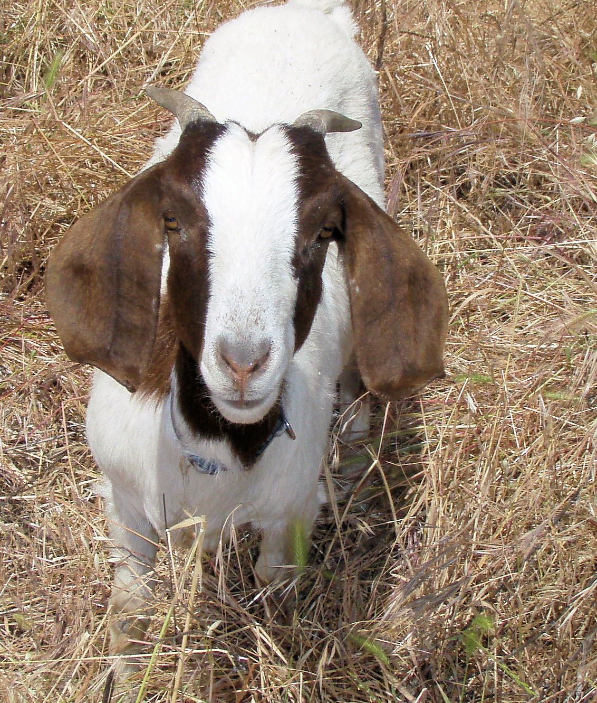

```{r setup, include=FALSE}
library(tidyverse)
knitr::opts_chunk$set(echo = TRUE)
knitr::opts_chunk$set(fig.dim=c(4.8, 4.5), fig.retina=2, out.width="100%")
theme_set(theme_minimal())
```

class: middle, inverse

## Welcome to Data Mining

---

## Teaching team

In order of appearance:

Jonathan Marshall         |  Rewat (Ray) Khanthaporn
--------------------------|---------------------------
j.c.marshall@massey.ac.nz |  r.khanthaporn@massey.ac.nz
Manawatu ScB3.17          |  Albany

---

## Who am I?

<div align="center">
<span class='inline'>
  <a href="http://instagram.com/monstamini"></a>
  
  
</span>
</div>

- I'm a statistician with two pets and one kid.

- Interested in statistical modelling of disease.

- Two main areas: [spatio-temporal modelling](https://jmarshallnz.github.io/talks/nzsa2016), and [source attribution](jmarshallnz.github.io/talks/OHA2019).

---

## Topics

- Data wrangling and visualisation

- Missingness

- Prediction

- Classification

- Clustering

- Market basket analysis

---

## Software

We use R via RStudio. https://www.r-project.org

R was developed in Auckland, by [Ross Ihaka](https://en.wikipedia.org/wiki/Ross_Ihaka) and [Robert Gentleman](https://en.wikipedia.org/wiki/Robert_Gentleman_(statistician%29), but now there are a cast of thousands.

It is programming language that is built with statistical analyses in mind.

You will **learn to write code** to clean and visualise data, and build models for prediction.

We interact with R via the RStudio front-end: https://rstudio.com

Both are free, and you should install them on your computer.

---

## The tidyverse

In general we'll be using the tidyverse series of packages where we can.

- `readr` and `readxl` for loading data.

- `dplyr` and `tidyr` for data manipulation.

- `ggplot2` and `patchwork` for data visualisation. 

- `broom` for tidying model output.

The tidyverse website is a useful resource: https://tidyverse.org

---

## Getting help

- Use the stream forums to ask for help.

- Use the [Discord channel](https://discord.gg/Mzk7fUk) to ask for help.

- We encourage you to help your classmates on stream (or in workshops) as well.

- Try and help us (and your classmates) help you: e.g. if you have an R issue, copy your code and the error so we can spot the problem.

- Google is super useful! Include "R" or "RStudio" or maybe the name of the package "ggplot" or "dplyr" in your query.

- Check the date of the google responses: older results might well be out of date.

---

class: middle, inverse

# Data Mining

---

## Data Mining vs Statistics

There's a lot of overlap between many disciplines, and none more so than Statistics, Data Science, Data Mining, Artificial Intelligence and Machine Learning.

And even more broadly with Computer Science, Information Technology and Mathematics. And perhaps even more importantly some of the social sciences, especially ethics.

We'll be doing lots of these things in this course, though will be focusing on the statistical side.

In some ways, the difference is really in the size and type of problems being solved.

---

## Data Mining vs Statistics

- Statisticians tend to start by making modelling assumptions about how the data is generated. Generally these assumptions then give a mathematical framework in which to answer specific questions.

- Machine learning people tend to treat the mechanism that generates the data as unknown (or unknowable) and are happy to use any algorithmic model that gets the job done.

---

.pull-left[
## Example: Goats

Worm infestation in goats can be countered by drenching.

- Designed experiment (conducted in Lincoln, New Zealand) to investigate effect of drenching regimes on goats.

- 40 goats were divided at random into two groups of 20.

- Goats in first group got standard drenching program; those in second got intensive drenching regimen.

- Goat weight (kg) measured at start and end of year.
]

.pull-right[
```{r, echo=FALSE, fig.dim=c(2.5,4), out.width='100%', fig.align='right'}

```
]

---

.left-code[
## Example: Goats

- Principal question of interest here is whether type of drenching program affects a goat's weight gain.

- Secondary question is whether the level of weight gain depends on the goat's initial weight, and if so in what way.
]

.right-plot[
```{r, echo=FALSE, message=FALSE}
goats <- read_csv("../data/goats.csv")
ggplot(goats) +
  geom_point(aes(x=Wt.ini, y=Wt.gain, shape=Treatment, col=Treatment)) +
  labs(x = "Initial weight", y="Weight gain") +
  scale_colour_manual(values = c("black", "red")) +
  scale_shape_manual(values = c("circle open", "cross")) +
  theme(legend.position = 'bottom')
```
]

---

## A classical statistics problem

- This is kind of dataset and scientific problem that would have been familiar to statisticians almost a century ago.

- The dataset is of modest size.

- $n = 40$ cases (records)

- $p = 3$ variables (weight gain; initial weight; and treatment program)

- A statistician would use standard tools like regression and hypothesis testing.

---

## Example: Data Mining of Amazon Reviews

- Data on reviews published on Amazon.

- Information on 30 reviews by each of 50 reviewers (total of $n = 1500$ reviews).

- For each review, $p = 10,000$ variables are recorded. e.g.

    - Word frequencies (e.g. number of occurrences word 'book' in each review);
    - Usage of digits and punctuation;
    - Word and sentence length

---

```{r, echo=FALSE, message=FALSE, fig.dim=c(8,5), out.width='90%', fig.align='center'}
library(patchwork)
space_comma <- read_csv("../data/amazon_space_comma.csv")
g1 <- ggplot(space_comma) + geom_point(aes(x=Spaces, y=Commas), alpha=0.5) +
  labs(x = "Number of spaces", y = "Number of commas")
g2 <- ggplot(space_comma) + geom_histogram(aes(x=Spaces), bins=20, fill='grey70', col='grey30') + theme_void()
g3 <- ggplot(space_comma) + geom_histogram(aes(y=Commas), bins=20, fill='grey70', col='grey30') + theme_void()

g2 + plot_spacer() + g1 + g3 +
  plot_layout(ncol = 2, 
    nrow = 2, 
    widths = c(4, 1),
    heights = c(1, 4))
```

---

## Example: Data Mining of Amazon Reviews

- Very large dataset: 15 million individual pieces of data (goat data was 120).

- Dataset massively multivariate: $p = 10,000$ variables per record.

    - Note $p = 10000$ is larger than $n = 1500$, which would be unusual in classical statistics.

- Data collected in part for study of stylometry, but no specific scientific hypotheses.

- Data analysis could include:

    - Classification (who wrote what?)
    - Associations in written language (do comma users also like semi-colons?)
    - Applications in linguistics, artificial intelligence, source attribution.

---

.pull-left[
## Classical Statistics

- Datasets  can be quite modest in size.

- Methods typically designed to deal with situations where there are many more records $n$ than variables $p$.

- The aim of an analysis is often estimation or testing of some parameter or another.

- Models are usually easy to interpret.
]

.pull-right[
## Data Mining

- Almost always involves large to massive datasets.

- Having more variables $p$ than records $n$ is fairly common.

- The problems are more often concerned with classification, prediction, or association.

- Models are typically complex and 'black box' in nature.
]

---

## Key steps in data mining

1. Collect data (or get given it).

2. **Wrangle the data into shape.**

3. Train models (the more the better!)

4. Choose the best model.

5. Use the best model for prediction.

In practice, we end up spending the most time in step 2, as usually the data we find or are provided with needs work before we get on to fitting models.

---

class: middle, inverse

# Data wrangling

---

## Data wrangling

In general, data wrangling consists of doing everything necessary to get datasets 'tidy' and ready for modelling. This might involve:

- Transforming the shape of the data (e.g. from wide to long or vice-versa).

- Joining datasets from multiple sources.

- Processing columns to extract meaningful information.

- Combining columns of data to produce new columns.

- Filtering data (rows or columns) to remove junk we don't want.

- Dealing with missing values.

- Removing things that humans have added that aren't useful for computers.

We'll start the course with a quick review of how to do some of these using `dplyr` and `tidyr`, among other packages.

---

## Data wrangling with `dplyr`

Recall that `dplyr` has a set of verbs that help us solve the most common data manipulation challenges:

- `select` to choose variables (columns) by name.
- `filter` to choose observations (rows) by value.
- `mutate` to add new variables based of existing variables.
- `summarise` to reduce multiple values down to a single summary.
- `arrange` changes the order of rows.

All of these combine with `group_by` to do all the above operation on subgroups of the data.

---

## `dplyr`

One of the nice things about `dplyr` is it abstracts the language of data processing across the implementation of where the data exist. It works with `data.frame`'s loaded into memory, as well as remote databases (via SQL, or Apache Spark) using the same set of R commands.

The other nice thing is the consistency:
 - All verbs take in as their first argument a `data.frame`.
 - Then all other arguments describe what to do with the `data.frame`.
 - The result is then a new `data.frame`.

```{r, eval=FALSE}
new_data <- do_something(old_data, other, stuff)
```

This means that it works with the pipe `%>%` from the `magittr` package (or `|>` from base R). i.e.

```{r, eval=FALSE}
new_data <- old_data %>% do_something(other, stuff)
```

---

## Filtering rows
 
Let's look at some data from Horizon's Regional Council on river quality.

```{r, include=FALSE}
library(lubridate)
hrc <- read_csv("https://www.massey.ac.nz/~jcmarsha/data/horizons_river_ecoli.csv")
date <- hrc %>% mutate(Year = year(ymd(Date))) %>% pull(Year) %>% range()
```

```{r}
hrc
```

We have *E. coli* counts from `r hrc %>% count(Site) %>% nrow()` sites throughout the region from `r date[1]` to `r date[2]`.

---

## Filtering rows
 
What if we just wanted the rows from 2017 onwards?
 
```{r}
hrc %>% filter(Date >= '2017-01-01')
```

---

## Filtering rows
 
Or rows with large counts?

```{r}
hrc %>% filter(Value > 100000)
```

---

## Filtering rows
 
What if we wanted really low counts before 2010?

```{r}
hrc %>% filter(Value < 100, Date <= '2010-12-31')
```

---

## Filtering rows

What if we wanted the extreme low or high counts?

```{r}
hrc %>% filter(Value < 3 | Value > 100000)
```

---

## Logical expressions in R

The `filter` argument is a logical expression. i.e. it's something that evaluates to `TRUE` or `FALSE`.

For convenience, filter can take more than one logical expression, separated by a comma. In this case they're AND'd together (i.e. rows must satisfy both criteria), but anything within each expression is done first.

If we want to use OR rather than AND, we use the vertical bar `|` character.

i.e. `hrc %>% filter(Value < 3 | Value > 100000, SiteID == "00081")`

will return rows where the value is very small or very large from Site 00081.

---

## Logical expressions in R

Notice that for 'is equal to' we've been using `==`. The single `=` is for assignment of parameters instead. `dplyr` will warn you about this:

```{r, error=TRUE}
hrc %>% filter(Value = 4)
```

**This is rare** - usually error messages are rather more opaque!

Reading carefully, and searching the error on google can sometimes help.

---

## Logical expressions in R

Other operations are `!=` (not equal to) and `%in%` (in). e.g.

```{r}
hrc %>% filter(Value %in% c(3,5))
```

---

## Dealing with missing values

Notice the `Symbol` column is full of `NA` which means "missing". Maybe there are some that aren't missing? We might try:

```{r}
hrc %>% filter(Symbol != NA)
```

This seems like it might have worked?? It says there are no rows returned...

--

```{r}
hrc %>% filter(Symbol == NA)
```

Hmm, that doesn't seem right??

---

## Dealing with missing values

.left-code[
The key thing to remember is if a value is missing, then comparing it is senseless:

```{r}
2 == NA
NA == NA
```

Is 2 equal to something missing?

Maybe! We don't know! So the answer is missing.
]

--
.right-plot[
We use `is.na()` instead for this.

```{r}
is.na(2)
is.na(NA)
```
]

RStudio will remind you about this with a yellow warning in the margin, as it's a common problem.
---

## Dealing with missing values

Notice the `Symbol` column is full of `NA` which means "missing". Maybe there are some that aren't missing?

```{r}
hrc %>% filter(!is.na(Symbol))
```

Ok, it seems like we have a few (`r hrc %>% filter(!is.na(Symbol)) %>% nrow()`) numbers where the count actually means less than or greater than the value given, rather than equal to the value given.

---

## Arranging rows

Rather than pick rows out, we can sort the data instead.

```{r}
hrc %>% arrange(Value)
```

---

## Arranging rows

Selecting more than one variable to arrange on will first arrange on the first, then use later variables for ties:

```{r}
hrc %>% arrange(Value, Date)
```

---

## Arranging rows

To arrange descending rather than ascending, we can use `desc`

```{r}
hrc %>% arrange(Value, desc(Date))
```

Interestingly, no value of 1 after 2012... This suggests a change in the way things were measured.

---

## Combining filter and arrange

The nice thing about the pipe is it allows us to chain things together. Let's look at post-2012 values:

```{r}
hrc %>%
  filter(Date >= '2013-01-01') %>%
  arrange(Value)
```

It seems some of the values recorded as 4 actually mean "less than 4".

---

## Combining filter and arrange

```{r}
hrc %>% filter(Value > 50000) %>% arrange(Site, Date)
```

---

## Selecting and renaming columns

Just like we can select rows with `filter`, we can choose columns with `select`.

This is useful for getting rid of columns we don't need, for rearranging columns, and for changing names to
something more convenient.

```{r}
hrc %>% select(Site, Date, Value)
```

---

## Selecting columns

We can select a range of columns with a colon `:`

```{r}
hrc %>% select(Council, Site:RawValue)
```

---

## Selecting columns

We can select by column number instead of column name if you like:

```{r}
hrc %>% select(Council, 3:6)
```

Generally it's better to use names though, as the order of columns might be different to what you expect. But sometimes the names are junk, so numbers work best!

---

## Selecting columns

The `everything()` helper function is useful if you want one column first, then everything else:

```{r}
hrc %>% select(Symbol, Value, everything())
```

---

## Selecting columns

The `starts_with()` helper is useful if you have a bunch of columns that start similarly:

```{r}
hrc %>% select(Date, Value, starts_with("Site"))
```

---

## Selecting columns

You can rename a column just by changing it's name in the `select`:

```{r}
hrc %>% select(Site, Date, EColi = Value)
```

---

## Dropping columns

To drop a column use `-` in front of the name:

```{r}
hrc %>% select(-Indicator, -RawValue, -Symbol)
```

---

## Renaming columns

If you want to rename a column but don't want to specify all the other columns, then `rename()` does this:

```{r}
hrc %>% rename(Name = Site)
```

---

## Adding new columns

We can add new columns based on existing ones with `mutate`:

```{r}
hrc %>% select(SiteID, Date, Value) %>%
  mutate(Log10Value = log10(Value))
```

---

## Adding new columns

We can add new columns based on existing ones with `mutate`:

```{r, message=FALSE}
library(lubridate)
hrc %>% select(SiteID, Date, Value) %>%
  mutate(Year = year(Date), Month = month(Date, label=TRUE))
```

---

.left-code[
## Seasonality?
```{r, label='hrc_season', eval=FALSE}
hrc %>%
  mutate(
    Month = month(Date, label=TRUE)
    ) %>%
  ggplot() +
  geom_boxplot(
    aes(
      x = Month,
      y = Value)
    ) +
  scale_y_log10(
    labels = scales::label_comma()
  )
```

We can pipe the result of wrangling into
`ggplot()` as it takes a data.frame as first
argument.

Remember to switch from `%>%` to `+` !!
]

.right-plot[
```{r, ref.label='hrc_season', echo=FALSE, eval=TRUE}
```
]

---

## Changing columns

We can change existing columns by overwriting them:

```{r}
hrc %>% select(SiteID, Site, Date, Value) %>%
  mutate(SiteID = as.numeric(SiteID),
         Site = str_to_title(Site))
```

---

## Summarising rows

`summarise` computes summary statistics across all rows.

It generally takes lots of rows, performs some computation on one (or more) columns, and results in a single row output.

e.g. you can use this to compute means, medians, counts, totals or other summary statistics:

```{r}
hrc %>% summarise(Mean = mean(Value))
```

---

## Summarising rows

You can do as many summaries at once as you like:

```{r}
hrc %>% summarise(Mean = mean(Value),
                  Median = median(Value),
                  IQR = IQR(Value),
                  Count = n(),
                  Total = sum(Value),
                  Mean2 = Total / Count)
```

Notice in the `Mean2` computation, we're using columns that we computed earlier in the same `summarise()` command.

The `n()` function is useful for number of rows. Also `n_distinct()` for the number of distinct values.

---

## Summarising rows

You can use summaries that produce more than one result, and they'll be placed in multiple rows:

.pull-left[
```{r}
hrc %>%
  summarise(
    Quantile = quantile(Value)
    )
```

But, you need to make sure you know which is which!
]

--

.pull-right[
```{r}
hrc %>%
  summarise(
    Prob = c(0,0.25,0.5,0.75,1),
    Quantile = quantile(Value, probs=Prob)
    )
```

**Sticking to summaries that return a single value is safest.**
]

---

## Grouping

The power of `dplyr` is that it can do all of the previous actions on subgroups of the data (all at once) rather than the entire data.

.pull-left[
```{r}
hrc %>% select(SiteID, Date, Value)
```
]

.pull-right[
```{r}
hrc %>% select(SiteID, Date, Value) %>% 
  group_by(SiteID)
```
]

---

.pull-left[

## Grouping

So while this produces a single row:

```{r}
hrc %>%
  summarise(Median = median(Value))
```
]

--

.pull-right[
## &nbsp;

This produces multiple rows, one for each year:

```{r}
hrc %>% mutate(Year = year(Date)) %>%
  group_by(Year) %>% 
  summarise(Median = median(Value))
```
]

---

## Grouping multiple variables

When you `group_by()` more than one variable, the other verbs operate within unique combinations of those variables.

If you do a `summarise()` then you reduce the data down to one row for the inner-most variable. So it will drop this level of grouping, retaining grouping at higher levels.

```{r}
hrc %>%
  mutate(Year = year(Date)) %>%
  group_by(Site, Year) %>%
  summarise(Median = median(Value))
```

---

This means that subsequent operations happen at the `Site` level:

```{r}
hrc %>%
  mutate(Year = year(Date)) %>%
  group_by(Site, Year) %>%
  summarise(Median = median(Value)) %>%
  mutate(Overall = median(Median))
```

---

You can remove grouping with `ungroup()`:

```{r}
hrc %>%
  mutate(Year = year(Date)) %>%
  group_by(Site, Year) %>%
  summarise(Median = median(Value)) %>%
  ungroup() %>%
  mutate(Overall = median(Median))
```

---

## Counting

There are a number of other helper functions in `dplyr` thare are useful to know, such as `count()`.

```{r, eval=FALSE}
hrc %>% count(Site)
```

is equivalent to:

```{r, eval=FALSE}
hrc %>% group_by(Site) %>% summarise(n = n())
```

The function `add_count()` adds a count column instead of summarising.

---

.pull-left[
```{r}
hrc %>% count(Site)
```
]
.pull-right[
```{r}
hrc %>% add_count(Site) %>%
  select(Site, Value, n)
```
]

---

## Other helpers

`slice_min()` and `slice_max()` are useful for finding the top (or bottom) few entries.

.pull-left[
```{r}
hrc %>% select(Site, Value) %>%
  arrange(desc(Value)) %>%
  filter(row_number() <= 10)
```
]

.pull-right[
```{r}
hrc %>%
  select(Site, Value) %>%
  slice_max(Value, n=10)
```
]

---

## Other helpers

There are also `slice()` for taking rows out by row number, or `slice_head()` and `slice_tail()` for taking from the ends. `slice_sample()` can be used to take a random sample.

```{r}
hrc %>% slice_sample(n=10)
```

---

## Putting it all together

With the 6 main functions `select`, `arrange`, `filter`, `mutate`, `summarise` and `group_by` we can now answer many questions:

- Which are the best or worst sites on average (e.g. by Median)?

- Which sites do we not have much data on?

- Which sites are new?

- Which sites are tested infrequently?

---

Which sites are the **best** on average (by median)

```{r}
hrc %>% group_by(Site) %>%
  summarise(Median = median(Value)) %>%
  arrange(Median)
```

---

Which sites are the **worst** on average (by median)

```{r}
hrc %>% group_by(Site) %>%
  summarise(Median = median(Value)) %>%
  arrange(desc(Median))
```

---

Which sites are the **best** or **worst** on average (by median)

.pull-left[
```{r, message=FALSE}
hrc %>% group_by(Site) %>%
  summarise(Median = median(Value)) %>%
  slice_min(Median, n=5)
```
]

.pull-right[
```{r, message=FALSE}
hrc %>% group_by(Site) %>%
  summarise(Median = median(Value)) %>%
  slice_max(Median, n=5)
```
]

---

Which sites do we not have much data on?

```{r}
hrc %>% count(Site) %>% arrange(n)
```

---

Which sites are new?

```{r}
hrc %>% group_by(Site) %>%
  summarise(FirstDate = min(Date)) %>%
  arrange(desc(FirstDate))
```

---

Which sites are tested infrequently?

```{r}
hrc %>% group_by(Site) %>%
  summarise(DateRange = max(Date) - min(Date), Count = n()) %>%
  mutate(DaysPerTest = DateRange / Count) %>%
  arrange(desc(DaysPerTest))
```
