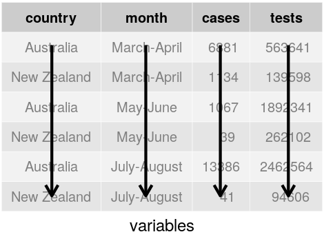
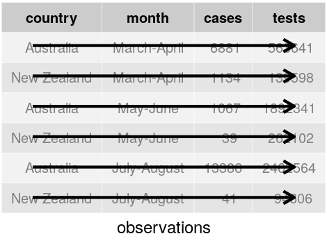
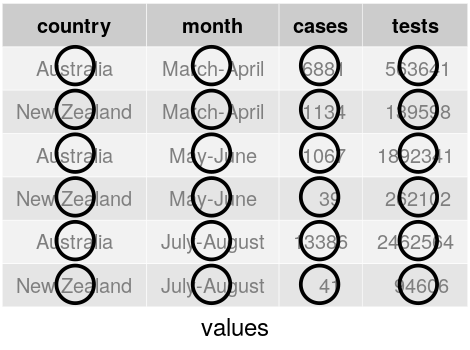
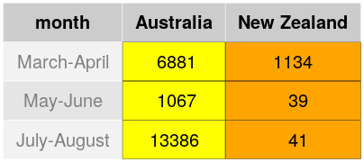
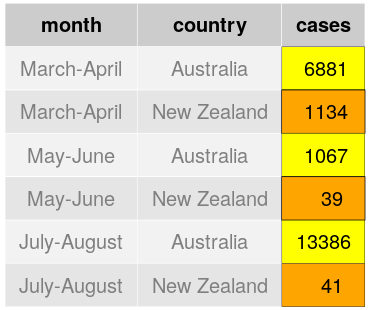
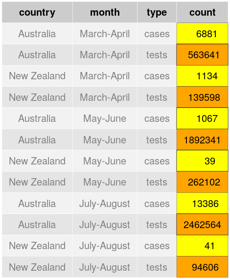
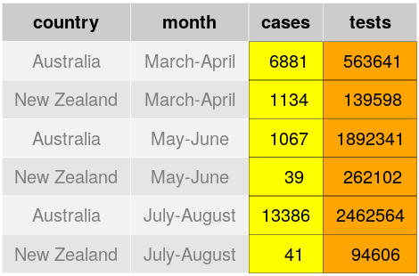

```{r setup, include=FALSE}
library(tidyverse)
knitr::opts_chunk$set(echo = TRUE)
knitr::opts_chunk$set(fig.dim=c(4.8, 4.5), fig.retina=2, out.width="100%", comment="#>")
#theme_set(theme_minimal())
library(palmerpenguins)
hrc <- read_csv("https://www.massey.ac.nz/~jcmarsha/data/horizons_river_ecoli.csv")

xaringanExtra:::use_freezeframe()
```

class: middle, inverse

# Small multiple plots

---

## Small multiple plots

With `dplyr` we can use `group_by()` to do summarising and filtering by subgroups of the data.

We can do the same thing when we produce plots with `ggplot2`.

The idea is that often we want to see trends or patterns between some variables, but often those trends
or patterns may vary by subgroup.

In that case we might want to plot them separately for each subgroup so
we can compare and contrast.

---

## Small multiple plots

Let's look at two sites on the Manawatu river near the Manawatu campus.

```{r}
two_sites <- hrc %>%
  filter(Site %in% c("manawatu at u/s pncc stp", "manawatu at teachers college"),
         Date >= "2008-01-01")

two_sites %>% group_by(Site) %>%
  summarise(Median = median(Value), Max = max(Value))
```

---

.left-code[
## Combining plots

```{r facet1, eval=FALSE}
ggplot(data=two_sites) +
  geom_line(
    mapping = aes(x=Date, y=Value,
                  col=Site)
    ) +
  scale_y_log10(
    labels = scales::label_comma()
  )
```

We could use colour to distinguish the sites
]

.right-plot[
```{r, ref.label="facet1", echo=FALSE}
```
]

---

.left-code[
## Combining plots

```{r facet2, eval=FALSE}
ggplot(data=two_sites) +
  geom_line(
    mapping = aes(x=Date, y=Value)
    ) +
  scale_y_log10(
    labels = scales::label_comma()
  ) +
  facet_wrap(vars(Site)) #<<
```

But having separate plots is better.
]

.right-plot[
```{r, ref.label="facet2", echo=FALSE}
```
]

---

.left-code[
## Combining plots

```{r facet3, eval=FALSE}
ggplot(data=two_sites) +
  geom_line(
    mapping = aes(x=Date, y=Value),
    alpha=0.5
    ) +
  geom_smooth(
    mapping = aes(x=Date, y=Value)
  ) +
  scale_y_log10(
    labels = scales::label_comma()
  ) +
  facet_wrap(vars(Site))
```

The trend shows that the site at Waitoetoe park used to be
worse than at Hokowhitu, but now is more similar.

They're now both worse?
]

.right-plot[
```{r, ref.label="facet3", echo=FALSE}
```
]

---

.left-code[
## Combining plots

```{r facet5, eval=FALSE}
ggplot(data=two_sites) +
  geom_line(
    mapping = aes(x=Date, y=Value),
    alpha=0.5
    ) +
  geom_smooth(
    mapping = aes(x=Date, y=Value)
  ) +
  scale_y_log10(
    labels = scales::label_comma()
  ) +
  facet_wrap(vars(Site), ncol=1) #<<
```

Can specify the number of rows or columns.

This allows us to see the correlation in the two Manawatu measures.

But is harder to assess overall levels.
]

.right-plot[
```{r, ref.label="facet5", echo=FALSE}
```
]

---

.left-code[
## Combining plots

```{r peng1, eval=FALSE}
ggplot(penguins) + 
  geom_density(aes(x=body_mass_g),
               fill='light blue') +
  facet_grid( #<<
    rows = vars(sex), #<<
    cols = vars(species) #<<
  ) #<<
```

If we have two variables that we'd like to use to split the data, we can use a grid
of small plots, with rows representing one variable and columns the other.

The `NA` for `sex` though is a bit odd!
]

.right-plot[
```{r, ref.label="peng1", echo=FALSE, message=FALSE}
```
]

---

.left-code[
## Combining plots

```{r peng2, eval=FALSE}
penguins %>% #<<
  filter(!is.na(sex)) %>% #<<
ggplot() + 
  geom_density(aes(x=body_mass_g),
               fill='light blue') +
  facet_grid(
    rows = vars(sex),
    cols = vars(species)
  )
```

For densities, where the `x` axis is our comparator, we can
easily assess down columns.

i.e. Males are heavier than females for each species, less pronounced in Chinstrap?
]

.right-plot[
```{r, ref.label="peng2", echo=FALSE}
```
]

---

.left-code[
## Combining plots

```{r peng3, eval=FALSE}
penguins %>%
  filter(!is.na(sex)) %>%
ggplot() + 
  geom_density(aes(x=body_mass_g),
               fill='light blue') +
  facet_grid(
    rows = vars(species), #<<
    cols = vars(sex) #<<
  )
```

For densities, where the `x` axis is our comparator, we can
easily assess down columns.

Switching roles of variables means we can easily compare within
males and females separately.

e.g. we see that male Adelie and Chinstraps have similar weight distributions,
while females differ.
]

.right-plot[
```{r, ref.label="peng3", echo=FALSE}
```
]

---

.left-code[
## Combining plots

```{r peng4, eval=FALSE}
penguins %>%
  filter(!is.na(sex)) %>%
ggplot() + 
  geom_density(aes(x=body_mass_g,
                   fill=species),
               alpha=0.5) + #<<
  facet_wrap(vars(sex), #<<
             ncol=1) #<<
```

In this example the small number of groups allows overlapping
densities to be a little better perhaps.
]

.right-plot[
```{r, ref.label="peng4", echo=FALSE}
```
]

---

## Combining different kinds of plot

Sometimes we want to combine different types of plot. e.g. perhaps we want
to compare the body mass distribution of penguins as well as show the correlation
between bill length and depth.

We can do the separate plots and can combine them using the `patchwork` library

---

.pull-left[
```{r, warning=FALSE}
ggplot(penguins) +
  geom_density(
    aes(x=body_mass_g,
        fill=species),
    alpha=0.5)
```
]

.pull-right[
```{r, warning=FALSE}
ggplot(penguins) +
  geom_point(aes(x=bill_length_mm,
                 y=bill_depth_mm,
                 col=species),
               alpha=0.5)
```
]

---

## Combining plots with patchwork

With `patchwork` we first save the plots into separate variables, then use `+` or `/` to combine them together.

When you save a `ggplot2` plot, you can 'print' it out by just typing the name. So your code will look like:

```{r, eval=FALSE}
g1 = ggplot(data1) + ...
g2 = ggplot(data2) + ...

g1 # To look at the first plot
g2 # To look at the second plot

library(patchwork)
g1 + g2 # To put graphs side by side
g1 / g2 # To put graphs top and bottom
```

---

.left-code[
## Combining plots with patchwork

```{r patch1, eval=FALSE}
library(patchwork)
g1 = ggplot(penguins) +
  geom_density(
    aes(x=body_mass_g,
        fill=species),
    alpha=0.5)

g2 = ggplot(penguins) +
  geom_point(
    aes(x=bill_length_mm,
        y=bill_depth_mm,
        col=species),
    alpha=0.5)

g1 / g2
```
]

.right-plot[
```{r, ref.label="patch1", echo=FALSE, warning=FALSE}
```
]

---

## Combining plots with patchwork

Use `+` to put things side by side:

```{r, warning=FALSE, fig.dim=c(8,3), fig.retina=3}
g1 + g2
```

---

## Combining plots with patchwork

The `plot_layout()` function is useful to control things a little.

```{r, warning=FALSE, fig.dim=c(8,3), fig.retina=3}
g1 + g2 + plot_layout(guides = 'collect')
```

---

The `plot_annotation()` function allows adding titles, subtitles to the total layout.

```{r, warning=FALSE, fig.dim=c(8,3), fig.retina=3}
g1 + g2 + plot_layout(guides = 'collect') +
  plot_annotation(title = "Gentoo penguins are chonky and have long, narrow beaks")
```

---

Lots more can be done. See https://patchwork.data-imaginist.com/index.html for more!

```{r, echo=FALSE, warning=FALSE}
g0 = ggplot(penguins) + geom_density(aes(x=flipper_length_mm, fill=species), alpha=0.5)
```

```{r, warning=FALSE, fig.dim=c(8,3.5), fig.retina=3}
(g0 / g1 | g2) + plot_layout(guides = 'collect') +
  plot_annotation(title = "Gentoo penguins are chonky and have long, narrow beaks")
```

---

class: middle,inverse

# Theming

---

## Theming

The entire layout of a `ggplot2` chart can be customised by the `theme`:

- Background colours
- Size of panel
- All text size, font, style, placement, justification, angle etc
- Space between facets, facet header styles

Basically everything you see on the plot can be customised.

The **easiest** way to customise the plot is to choose a pre-made theme. (Let someone else do the work!)

---

.left-code[
## Themes

```{r theme1, warning=FALSE, eval=FALSE}
ggplot(penguins) +
  geom_density(
    aes(x=body_mass_g,
        fill=species),
    alpha=0.5)
```

The standard theme is `theme_grey`.
]

.right-plot[
```{r, ref.label="theme1", warning=FALSE, echo=FALSE}
```
]

---

.left-code[
## Themes

```{r theme2, warning=FALSE, eval=FALSE}
ggplot(penguins) +
  geom_density(
    aes(x=body_mass_g,
        fill=species),
    alpha=0.5) +
  theme_bw()
```

]

.right-plot[
```{r, ref.label="theme2", warning=FALSE, echo=FALSE}
```
]

---

.left-code[
## Themes

```{r theme3, warning=FALSE, eval=FALSE}
ggplot(penguins) +
  geom_density(
    aes(x=body_mass_g,
        fill=species),
    alpha=0.5) +
  theme_light()
```
]

.right-plot[
```{r, ref.label="theme3", warning=FALSE, echo=FALSE}
```
]

---

.left-code[
## Themes

```{r theme4, warning=FALSE, eval=FALSE}
ggplot(penguins) +
  geom_density(
    aes(x=body_mass_g,
        fill=species),
    alpha=0.5) +
  theme_dark()
```
]

.right-plot[
```{r, ref.label="theme4", warning=FALSE, echo=FALSE}
```
]

---

.left-code[
## Themes

```{r theme5, warning=FALSE, eval=FALSE}
ggplot(penguins) +
  geom_density(
    aes(x=body_mass_g,
        fill=species),
    alpha=0.5) +
  theme_minimal()
```
]

.right-plot[
```{r, ref.label="theme5", warning=FALSE, echo=FALSE}
```
]

---

.left-code[
## Themes

```{r theme6, warning=FALSE, eval=FALSE}
ggplot(penguins) +
  geom_density(
    aes(x=body_mass_g,
        fill=species),
    alpha=0.5) +
  theme_minimal(base_size=16)
```

The `base_size` argument sets the default text size.
]

.right-plot[
```{r, ref.label="theme6", warning=FALSE, echo=FALSE}
```
]

---

.left-code[
## Themes

```{r theme7, warning=FALSE, eval=FALSE}
ggplot(penguins) +
  geom_density(
    aes(x=body_mass_g,
        fill=species),
    alpha=0.5) +
  theme_minimal() +
  theme(legend.position = 'bottom')
```

The `theme()` function is how you alter elements of an existing theme.
]

.right-plot[
```{r, ref.label="theme7", warning=FALSE, echo=FALSE}
```
]

---

class: middle,inverse

# Combining data

---

## Combining data through joins

It is common to receive data in several different spreadsheets.

e.g. if doing a study where samples are taken from animals across farms, you might have a samples spreadsheet, an animals spreadsheet, and a farms spreadsheet.

For final analyses on samples, however, you might want to assess animal or farm-level effects on outcomes at the sample level.

Thus, you'll need to combine the data from these spreadsheets together into a single `data.frame`.

In RStudio, we do this using **joins** in `dplyr`.

---

## Data sets

We'll use a couple of datasets from the Star Wars movies for this.

```{r, message=FALSE}
characters <- read_csv("https://www.massey.ac.nz/~jcmarsha/data/sw_characters.csv")
characters
```

---

## Data sets

We'll use a couple of datasets from the Star Wars movies for this.

```{r, message=FALSE}
films <- read_csv("https://www.massey.ac.nz/~jcmarsha/data/sw_films.csv")
films
```

---

## Joining with `dplyr`

There are two main types of join in dplyr: **mutating joins** and **filtering joins**.

- Mutating joins add new columns from the additional dataset.

- Filtering joins filter out existing columns based on information in the additional dataset.

For both, we need a set of 'primary' or 'key' columns: these are columns that share the same
information so we can merge the datasets together.

e.g. The `films` and `characters` datasets share the `name` column, so that will be our key.

---

## Mutating joins

There are four separate mutating joins:

- `left_join(x,y)` returns all rows in x, and all rows that match these in y. If y doesn't have a match, `NA` will be used.

- `right_join(x,y)` returns all rows in y and all rows that match these in x. If x doesn't have a match in y, `NA` will be used.

- `inner_join(x,y)` returns only rows in x and y that have a match.

- `full_join(x,y)` returns all rows in x and all rows in y. Anything in x or y that don't have a match will be filled with `NA`.

**We'll only look at `left_join` as that's the one that works for 99% of cases.**
---

.left-code[
## Left join

`left_join(x, y)` returns:
- all rows in x
- all rows that match these in y.
- If y doesn't have a match, `NA` is used.

Rows in y that do not match rows in x are dropped.
]

.right-plot[

]

---

.left-code[
## Left join

`left_join(x, y)` returns:
- all rows in x
- all rows that match these in y.
- If y doesn't have a match, `NA` is used.

If more than one row in y matches a row in x then you duplicate the x information.
]

.right-plot[

]

---

`left_join(x, y)` returns all rows in x, and all rows that match these in y. If y doesn't have a match, `NA` will be used.

```{r}
characters %>% left_join(films)
```

---

class: middle, inverse

# Tidy data

---

## Tidy data

Consider the following data on COVID-19 case and testing numbers from New Zealand and Australia in 2020.

```{r, message=FALSE}
covid1 <- read_csv("http://www.massey.ac.nz/~jcmarsha/data/covid_au_nz.csv")
covid1
```

---

## Tidy data

Consider the following data on COVID-19 case and testing numbers from New Zealand and Australia in 2020.

```{r, message=FALSE}
covid2 <- read_csv("http://www.massey.ac.nz/~jcmarsha/data/covid_au_nz2.csv")
covid2
```

---

## Tidy data

Consider the following data on COVID-19 case and testing numbers from New Zealand and Australia in 2020.

```{r, message=FALSE}
covid3 <- read_csv("http://www.massey.ac.nz/~jcmarsha/data/covid_au_nz3.csv")
covid3
```

---

## Tidy data

Consider the following data on COVID-19 case and testing numbers from New Zealand and Australia in 2020.

```{r, message=FALSE}
covid4a <- read_csv("http://www.massey.ac.nz/~jcmarsha/data/covid_au_nz4a.csv")
covid4b <- read_csv("http://www.massey.ac.nz/~jcmarsha/data/covid_au_nz4b.csv")
covid4a
covid4b
```

---

## Tidy data

All of these cases represent the exact same values on the four variables of `country`, `month`, `cases` and `tests` but
each arrange it differently.

- `covid1` has each of these as separate columns.

- `covid2` has a `type` and `count` column combining `cases` and `tests`.

- `covid3` has the `cases` and `tests` columns combined into a `rate` (cases per test) variable.

- `covid4a` and `covid4b` has the cases and tests data separate, and has separate columns for each country.

One of these, the **tidy** dataset, will be much easier to work with than the others, particularly when using `ggplot2` and `dplyr` (i.e. the `tidyverse`).

---

## Tidy data rules

There are three interrelated rules which make a dataset tidy:

1. Each variable should be a column.

2. Each observation should be a row.

3. Each value should have its own cell.

<div align="center">
<span class='inline'>
  </a>
  
  
</span>
</div>

---

## Tidy data

In the previous examples, only `covid1` is tidy, as it's the only example where each
column is a variable.

`covid2` has variable names in rows (in the `type` column), which means observations are scattered across more than one row.

`covid3` has two separate variables in a single column (the `rate` column).

`covid4a` and `covid4b` has a variable spread over two columns (the country columns) where column names represent values.

--

**The key is to identify what are the variables, and what are observations?**

---

## Two common problems

Data in the real world is often not tidy.

Often it suffers from one of two problems:

- A variable might be spread across multiple columns (e.g. `covid4a` and `covid4b`)

- Observations may be spread across multiple rows (e.g. `covid2`).

We fix the first by making the data **longer** (combine columns shifting values into new rows).

We fix the second by making the data **wider** (combine rows by shifting values into new columns).

---

class: middle, inverse

# Pivoting between wide and long

---

## Pivoting longer

`covid4a` suffers as a single variable (`cases`) is distributed across the two country columns. The country column names are values that the `country` variable takes, and each row represents two observations, not one.

```{r}
covid4a
```

--

We fix this by pivoting the two country columns into a new pair of variables. We need three things:

- The set of columns whose names are values rather than variables. This would be `Australia` and `New Zealand`.
- The name of the variable to move the column names into. In this case `country`.
- The name of the variable to move the column values into. In this case `cases`.

---

## Pivoting longer

`covid4a` is too wide, so let's take the `Australia` and `New Zealand` columns and pivot to a new set of columns `country` and `cases`.

```{r}
covid4a %>%
  pivot_longer(c(Australia, `New Zealand`), names_to="country", values_to="cases")
```

We use quotes around the `country` and `cases` as they're not existing names.

This is now tidy: each row is an observation, each column is a variable, and all cells are values.

---

## Pivoting longer

`covid4a` is too wide, so let's take the `Australia` and `New Zealand` columns and pivot to a new set of columns `country` and `cases`.

<div align="center">
  <span class='inline'>
    
    
    
  </span>
</div>

This is now tidy: each row is an observation, each column is a variable, and all cells are values.

---

## Combining tables 4a and 4b

Once we have pivoted both tables to long format, we can join them with `left_join`
```{r}
tidy4a = covid4a %>%
  pivot_longer(c(Australia, `New Zealand`), names_to = "country", values_to = "cases")
tidy4b = covid4b %>%
  pivot_longer(c(Australia, `New Zealand`), names_to = "country", values_to = "tests")
tidy4a %>% left_join(tidy4b)
```

---

## Pivoting wider

`covid2` is too long: an observation is a country in a month, but each observation is spread across
two rows (one for cases, one for tests).

.pull-left[
```{r}
covid2
```
]

--

.pull-right[
To tidy this up, we note that:

- The variable names are in the `type` column.

- The values for those variables are in the `count` column.

We use `pivot_wider()` for this.
]
---

## Pivoting wider

`covid2` is too long: we need to take the `type` and `count` columns and pivot so that the variables in `type` are separate columns.

```{r}
covid2 %>%
  pivot_wider(names_from = type, values_from = count)
```

Note that we don't need to quote the `type` and `count` as they are existing column names.

---

## Pivoting wider

`covid2` is too long: we need to take the `type` and `count` columns and pivot so that the variables in `type` are separate columns.

<div align="center">
  <span class='inline'>
    
    
    
  </span>
</div>

---

## Pivoting wider: Tables

Not all untidy data is bad!

Sometimes we **want** untidy data. What is untidy as far as a computer goes is not necessarily untidy for humans!

e.g. `covid4a` is probably quite a nice way of summarising the case data.

```{r}
covid4a
```

What might be better is to compute the percentage of cases by tests, to get a feel for whether testing was adequate at various stages.

---

## Pivoting wider: Tables

Using the tidy `covid1` data, we could compute rates and then pivot wider to a tabular display:

```{r}
covid1 %>%
  mutate(rate = cases/tests * 100) %>%
  select(-cases, -tests) %>%
  pivot_wider(names_from = country, values_from = rate) %>%
  knitr::kable(format='html', digits=2)
```

The `kable()` function just gives us a slightly prettier looking table.
