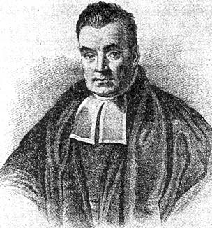
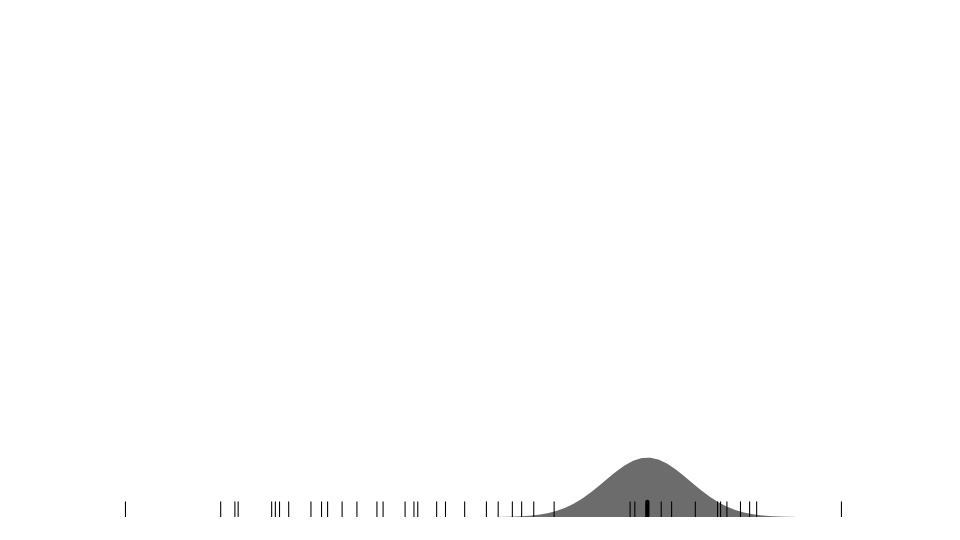

```{r setup, include=FALSE}
library(tidyverse)
library(skimr)
knitr::opts_chunk$set(echo = TRUE)
knitr::opts_chunk$set(fig.dim=c(4.8, 4.5), fig.retina=2, out.width="100%", comment="#>")
theme_set(theme_minimal())

swiss.train <- read_csv("../data/swiss-train.csv")
xaringanExtra:::use_freezeframe()
```

## Classification Methods

-   Goal is to assign each observation in test dataset to one of a
    (finite) number of pre-specified categories.

-   Information from training data allows us to derive a classification
    rule.

-   This is like prediction problem, but with a categorical target
    variable.

-   Some of the techniques from prediction transfer over with only minor
    modifications.

-   Classification also referred to as **supervised learning**.

-   Applications include

    -   Biological taxonomy (assignment of organisms to species).
    -   Diagnosis of disease.
    -   Assessment of credit risk.
    -   Forensics (classification of evidence).

---

## Goal of classification

-   Usually we cannot expect to get perfect classification.

-   An observation with a given set of features might possibly belong to
    any of the classes.

-   However, some classes are more likely given features than others.

    -   Suppose we try to determine if a video on Netflix is from a TV series or
        a movie, based on it's length.
    
    -   A video close to 2 hours long is more likely a movie, but not certainly.

-   It follows that we need to estimate **classification probabilities**
    $$P(\textrm{class} | \textrm{features})$$

-   Typically assign observation to class with highest classification
    probability

    -   But sometimes costs of wrong classification can depend on class.
        E.g. In medical diagnoses.

---

## Approaches to Classification

**Generative classifiers**

-   These generate probabilities
    $P(\textrm{class} | \textrm{predictors})$ by first estimating other
    distributions.

-   Rely on statistical theory like **Bayes theorem**.

**Discriminative classifiers**

-   Estimate $P(\textrm{class} | \textrm{predictors})$ directly.

-   Also referred to as **conditional** classifiers.

---

## Generative classifiers: Statistical Theory

-   Label possible classes $1, 2, \ldots, C$.

-   Let $\mathbf{x} = (x_1, x_2, \ldots, x_p)$ denote vector of features
    (predictor variables).

-   Let $f_j$ denote joint probability function of $\mathbf{x}$ for individuals
    in class $j$.

-   The probability function $f_j$ defines conditional probabilities of features
    for any given class.
    
    -   $f_j(\mathbf{x}) = \mathsf{P}(\mathbf{X} = \mathbf{x} | \mbox{class} = j)$

-   Let $\pi_j$ denote marginal (or unconditional) probability of being
    in class $j$.

    -   Often called the **prior** probability for class $j$.

---

## Classifying Bellbugs and Frongles

-   Renowned entomologist Professor Hamish McTwaddle has a collection of
    1000 Bellbugs and Frongles.

-   Each insect is either blue or green, and has either one white stripe
    or two.

```{r, echo=FALSE}
bugs <- tribble(~Insect, ~Colour, ~Stripe, ~Count,
        "Bellbugs", "Blue", 1, 50,
        "Bellbugs", "Blue", 2, 20,
        "Bellbugs", "Green", 1, 230,
        "Bellbugs", "Green", 2, 300,
        "Frongles", "Blue", 1, 200,
        "Frongles", "Blue", 2, 150,
        "Frongles", "Green", 1, 20,
        "Frongles", "Green", 2, 30) |>
  mutate(Stripe = paste(Stripe, "stripe")) |>
  pivot_wider(names_from=c(Colour, Stripe), values_from=Count, names_sep=" ")
bugs |> knitr::kable()
```

-   If class $j=1$ is Bellbugs, then:
    
    - $\pi_1 = \mathsf{P}(\mbox{Bellbug}) = 600/1000 = 0.6$.
    - $\pi_2 = \mathsf{P}(\mbox{Frongle}) = 400/1000 = 0.4$.
    - $f_1(\mbox{Blue, 1 stripe}) = \mathsf{P}(\mbox{Blue, 1 stripe} | \, \mbox{Bellbug}) = 50/600=0.083$.
    - $f_2(\mbox{Blue, 1 stripe}) = \mathsf{P}(\mbox{Blue, 1 stripe} | \, \mbox{Frongle}) = 200/400=0.5$.
    - $f_1(\mbox{Green, 2 stripe}) = \mathsf{P}(\mbox{Green, 2 stripe} | \, \mbox{Bellbug}) = 300 / 600 = 0.5$.
    - $f_2(\mbox{Green, 2 stripe}) = \mathsf{P}(\mbox{Green, 2 stripe} | \, \mbox{Frongle}) = 30 / 400 = 0.075$.

---

## Bayes' Theorem

-   Classification probability for class $j$ given feature vector $\mathbf{x}$
    is denoted by $\mathsf{P}(j | \mathbf{x})$ for $j=1,\ldots,C$.

    -   Can be referred to as **posterior** probability for class $j$
        based on data $\mathbf{x}$.

-   Want to relate $\mathsf{P}(j | \mathbf{x})$ to $f_j(\mathbf{x})$ and $\pi_j$ for
    $j=1,\ldots,C$.

-   Can be done using Bayes' theorem:
    $$\mathsf{P}(j | \mathbf{x}) = \frac{ \pi_j f_j(\mathbf{x}) }{f(\mathbf{x})},\qquad j=1,\ldots,C$$
    where $f(\mathbf{x}) = \sum_i \pi_i f_i(\mathbf{x})$ is marginal probability
    function for $\mathbf{x}$.

-   Note that denominator in equation is same for all classes $j$.

-   Hence most probable class is the one for which $\pi_j f_j(\mathbf{x})$ is
    largest.

---

.left-code[

## Bayes' Theorem: An Aside

- Bayes' theorem attribute to Rev. Thomas Bayes (1701--1761).

- The theorem is incredibly important to modern statistics.
 
- It permits the reversal of conditional probability statements:

$$\begin{align}P(A | B) &= \frac{P(A \cap B)}{P(B)}\\&=\frac{P(B \cap A)}{P(B)}\\&=\frac{P(B | A)P(A)}{P(B)}\end{align}$$

- It is the foundation stone of **Bayesian statistics**.
]

.right-plot[
```{r, echo=FALSE}

```
]

---

## More Bellbugs and Frongles

Based on the same table:

```{r, echo=FALSE}
bugs |> knitr::kable()
```

The probability that a blue 1 stripe is a Bellbug is given by:

$$\begin{aligned} P(\mbox{Bellbug} | \mbox{Blue, 1 stripe}) &= \frac{\pi_1 f_1(\mbox{Blue, 1 stripe})}{\pi_1 f_1(\mbox{Blue, 1 stripe}) + \pi_2 f_2(\mbox{Blue 1 stripe})}\\ &= \frac{0.6 \times 0.083}{0.6 \times 0.083 + 0.4 \times 0.5}\\ &= \frac{0.05}{0.05+0.20} = 0.2\end{aligned}$$

---

## More Bellbugs and Frongles

Based on the same table:

```{r, echo=FALSE}
bugs |> knitr::kable()
```

The probability that a green 2 stripe is a Frongle is given by:

$$\begin{aligned} P(\mbox{Frongle} | \mbox{Green, 2 stripe}) &= \frac{\pi_2 f_2(\mbox{Green, 2 stripe})}{\pi_1 f_1(\mbox{Green, 2 stripe}) + \pi_2 f_2(\mbox{Green 2 stripe})}\\ &= \frac{0.4 \times 0.075}{0.6 \times 0.5 + 0.4 \times 0.075}\\ &= \frac{0.03}{0.3+0.03} = 0.09\end{aligned}$$

---

## Error Rates

-   The performance of a classifier is usually measured by its
    **misclassification rate**.

-   The misclassification rate is the proportion of observations
    assigned to the wrong class.

-   Often useful to cross-tabulate the predicted classes versus the
    actual classes on a validation set.

    -   This is called the **confusion matrix**.

-   Often the aim is to select classifier with smallest
    misclassification rate.

-   If some mistakes are more important than others, may choose to
    minimize weighted misclassification rate.

    -   E.g. false negatives more important than false positives in
        medical diagnoses.

---

## Designing Generative classifiers

-   Recall that by Bayes' theorem,
    $$P(j | \mathbf{x}) = \frac{\pi_j f_j(\mathbf{x})}{f(\mathbf{x}) },$$ where
    $f(\mathbf{x}) = \sum_i \pi_i f_i(\mathbf{x})$.

-   $\pi_j = \mathsf{P}(j)$ is prior probability of being in class $j$.

-   $f_j(\mathbf{x})$ is the probability function of features (predictors) for
    class $j$.

-   How do we obtain prior probabilities $\pi_j$ and probability
    functions $f_j$ for $j=1, \ldots, C$ from the training data?

---

## Example: Swiss banknotes

```{r, message=FALSE}
swiss.train <- read_csv("https://www.massey.ac.nz/~jcmarsha/data/swiss-train.csv") |>
  mutate(type = factor(type))
swiss.test  <- read_csv("https://www.massey.ac.nz/~jcmarsha/data/swiss-test.csv") |>
  mutate(type = factor(type))
swiss.train |> slice_head(n=4)
```

-   Training data contains 120 records, testing data 80 records, on:

    -   `margin` (size of bottom margin, in mm)
    -   `diagonal` (length of diagonal, in mm)
    -   `type`, two level factor: forged or genuine

---

.left-code[
## Example: Swiss banknotes

```{r swissbox, eval=FALSE}
ggplot(swiss.train) +
  geom_boxplot(
    mapping = aes(x=type, y=margin))
```

-   Obvious difference between margin sizes for genuine and forged notes.

-   The probability distribution of margin within genuine and forged notes could
be used for $f_j$.

-   We could fit a distribution to this (e.g. a normal) or use a histogram
or density to estimate the distirbution.
]

.right-plot[
```{r, ref.label="swissbox", echo=FALSE}
```
]

---

## Prior Probabilities

-   Often estimate $\pi_j$ by relative frequency of class $j$ in
    training data.

-   This is a good idea if training data is representative of population
    of test cases.

    -   Professor McTwaddle collected insects at random from their
        natural habitat.

    -   Ratio 60:40 of Bellbugs to Frongles is representative of
        prevalence of these species.

    -   Hence $\pi_1 = \mathsf{P}(\mbox{Bellbug}) = 0.6$ is sensible prior.

-   For combined Swiss banknote datasets, relative frequency of forged
    and genuine is about 50:50.

-   This does not reflect proportion of forged and genuine notes in
    general circulation.

    -   Setting $\pi_1 = \mathsf{P}(\mbox{forged}) = 0.5$ not a good idea.

    -   Perhaps ask police experts for their estimate of prevalence of
        forged notes.

---

## Estimating $f_j$ for numerical feature variables

-   Assume that the $f_j$ are normal probability densities. **Linear discriminant analysis**

-   Estimate $f_j$ using kernel density estimation. **Kernel discriminant analysis**

-   Assume feature variables are independent, allowing the joint
    probability functions to be factorised to make estimation easier. **Naive Bayes**

---

class: middle, inverse

# Linear Discriminant Analysis

---

## Linear Discriminant Analysis

-   Linear Discriminant Analysis is often abbreviated to LDA.

-   LDA applicable when all the features are quantifiable.

-   We assume that $f_j$ is a (joint) normal probability distribution.

-   In addition, we assume that the covariance matrix is the same from
    class to class.

-   The classes are differentiated by locations of their means.

---

## LDA in a Simple Two Class Situation

-   Suppose we have just $p=1$ feature and $C=2$ classes.

-   We assume that $f_j(x)$ is a normal distribution for $j=1,2$.

-   We assume $f_1$ and $f_2$ have same variance.

-   Based on training data, suppose we estimate:

    -   Common variance $\sigma^2 = s^2$.

    -   Mean for class 1 $\mu_1 = \bar x_1$

    -   Mean for class 2 $\mu_2 = \bar x_2$

-   Hence model is $f_1 = \mathsf{Normal}(\bar x_1, s^2)$ and
    $f_2 = \mathsf{Normal}(\bar x_2, s^2)$.

-   Assume classes have equal prior probability: $\pi_1 = \pi_2 = 0.5$.

---

## Classifying a Test Case

-   Test case has feature value $x_0$. How should this be classified?

-   From Bayes' theorem, posterior probability for class $j$ is
    $$P(j | \, x_0) = \frac{\pi_j f_j(x_0)}{f(x_0) }.$$

-   Assign to class 1 if and only if $\mathsf{P}(1 | \, x_0) > \mathsf{P}(2 | \, x_0)$.

-   Equivalently, assign to class 1 if and only if
    $\pi_1 f_1(x_0) > \pi_2 f_2(x_0)$.

-   But $\pi_1 = \pi_2 = 0.5$ assumed...

-   ... so assign to class 1 if and only if $f_1(x_0) > f_2(x_0)$.

---

## Classifying a Test Case

-   Normal probability function is given by
    $$f(x) = \frac{1}{\sqrt{2 \pi} \sigma} e^{ - (x - \mu)^2/(2 \sigma^2) }$$

-   Hence:

$$\begin{aligned}f_1(x_0) > f_2(x_0) &\Leftrightarrow& \frac{1}{\sqrt{2 \pi} s} e^{ - (x_0 - \bar x_1)^2/(2 s^2) } > \frac{1}{\sqrt{2 \pi} s} e^{ - (x_0 - \bar x_2)^2/(2 s^2) }\\&\Leftrightarrow& e^{ - (x_0 - \bar x_1)^2/(2 s^2) } > e^{ - (x_0 - \bar x_2)^2/(2 s^2) }\\&\Leftrightarrow&  - (x_0 - \bar x_1)^2/(2 s^2)  >  - (x_0 - \bar x_2)^2/(2 s^2) \\&\Leftrightarrow&   (x_0 - \bar x_1)^2  <   (x_0 - \bar x_2)^2 \\&\Leftrightarrow&   |x_0 - \bar x_1|  <   |x_0 - \bar x_2| \\\end{aligned}$$

---

## Classifying a Test Case

-   So we assign test case to class 1 if and only if
    $|x_0 - \bar x_1|  <   |x_0 - \bar x_2|$

-   In other words, assign test case to class 1 if and only if $x_0$ is
    closer to $\bar x_1$ than $\bar x_2$.

    -   I.e. if $x_0 < (\bar x_1 + \bar x_2)/2$.

-   This is very natural!

---

## 'Very natural'

If we plot $f_1$ and $f_2$ we can see why it works out:

```{r, echo=FALSE, fig.dim=c(7.5,3)}
ggplot(data = data.frame(x=c(-3,5)), aes(x)) +
  stat_function(fun = dnorm, n=101, args = list(mean = 0, sd = 1), col='steelblue') +
  stat_function(fun = dnorm, n=101, args = list(mean = 2, sd = 1), col='darkred') +
  scale_x_continuous(breaks = c(0, 2), labels = c(expression(mu[1]), expression(mu[2]))) +
  geom_vline(xintercept=1, linetype = 'dotted')+
  theme_minimal() +
  labs(x=NULL, y=NULL) +
  theme(axis.text.y = element_blank())
```

---

## Classifying a Test Case

-   Assign test case to class 1 if and only if $x_0$ is
    closer to $\bar x_1$ than $\bar x_2$.

    -   I.e. if $x_0 < (\bar x_1 + \bar x_2)/2$.

-   The idea extends naturally to situations with $C \ge 3$ classes, and
    with $p \ge 2$ feature variables.

    -   Underlying mathematics remains essentially unchanged.

    -   For equal prior probabilities, assumption to normality for all
        $f_j$ for $j=1,\ldots,C$ leads to rule 'assign to class with
        closest mean'.

    -   Result is that classification follows partition of feature by a
        number of linear separators (hyperplanes).

---

## LDA separates the classes with hyperplanes

```{r, echo=FALSE, fig.dim=c(7,3.5)}
par(mar=c(4,4,2,2), mfrow=c(1,2))
plot((-1):2,(-1):2,type="n",xlab=expression(x[1]),ylab=expression(x[2]), asp=1)
polygon(c(-3,-3,4),c(4,-3,-3),col=8)
polygon(c(4,4,-3),c(-3,4,4),col=5)
lines(c(-3,4),c(4,-3),lwd=2)
points(0,0,pch=19,col=1)
points(1,1,pch=19,col=4)
text(0,-0.15,expression(mu[1]),cex=1.5)
text(1,1.15,expression(mu[2]),cex=1.5)

plot((-2):2,(-1):3,type="n",xlab=expression(x[1]),ylab=expression(x[2]), asp=1)
lines(c(-3,0),c(-2,1),lwd=2)
lines(c(0,3),c(1,-2),lwd=2)
lines(c(0,0),c(1,4),lwd=2)
polygon(c(-5,-5,0,0),c(-4,4,4,1),col=5)
polygon(c(5,5,0,0),c(-4,4,4,1),col="pink")
polygon(c(-5,0,5),c(-4,1,-4),col=8)
points(0,0,pch=19,col=1)
points(1,1,pch=19,col=2)
points(-1,1,pch=19,col=4)
text(0,0.2,expression(mu[1]),cex=1.5)
text(1,1.2,expression(mu[2]),cex=1.5)
text(-1,1.2,expression(mu[3]),cex=1.5)
```

---

## Different priors: The hyperplanes shift to favour more likely classes

```{r, echo=FALSE, fig.dim=c(7,3.5)}
par(mfrow=c(1,2), mar=c(4,4,2,2))
plot((-1):2,(-1):2,type="n",xlab=expression(x[1]),ylab=expression(x[2]))
polygon(c(-3,-3,4),c(4,-3,-3),col=8)
polygon(c(4,4,-3),c(-3,4,4),col=5)
lines(c(-3,4),c(4,-3),lwd=2)
points(0,0,pch=19,col=1)
points(1,1,pch=19,col=4)
text(0,-0.15,expression(mu[1]),cex=1.5)
text(1,1.15,expression(mu[2]),cex=1.5)
title(expression(paste(pi[1],"=",pi[2],"=1/2")),cex.main=1.5)
plot((-1):2,(-1):2,type="n",xlab=expression(x[1]),ylab=expression(x[2]))
polygon(c(-3,-3,4),c(4,-3,-3)+log(2),col=8)
polygon(c(4,4,-3),c(-3+log(2),4+log(2),4+log(2)),col=5)
lines(c(-3,4),c(4+log(2),-3+log(2)),lwd=2)
points(0,0,pch=19,col=1)
points(1,1,pch=19,col=4)
text(0,-0.15,expression(mu[1]),cex=1.5)
text(1,1.15,expression(mu[2]),cex=1.5)
title(expression(paste(pi[1],"=2",pi[2],"=2/3")),cex.main=1.5)
```

---

## Linear Discriminant Analysis in R

-   Linear discriminant analysis implemented using `lda` function in R.

-   We will use the `discrim_linear()` wrapper function available in the
    `parsnip` add-on package `discrim`.

-   Prior probabilities can be specified using the `prior` argument to
    `set_engine()`.

    -   The default will use the proportions in the data.

-   Classifications on test data done using `predict` or `augment`
    in the usual manner.

-   The `conf_mat()` function from `yardstick` can be used to evaluate
    performance. In addition the `accuracy()` function gives classification
    rates.

---

.left-code[
## LDA for forged banknotes

```{r swisslda, eval=FALSE}
library(discrim)
library(yardstick)
swiss.lda <- discrim_linear() |>
  fit(type ~ ., data=swiss.train)
swiss.lda
```

The `swiss.lda` object is a `parsnip` model
and drops out the underlying `lda` information.

Priors and group means have been estimated.

The coefficients of linear discriminants define
a matrix transformation from the scaled features
to the discriminants.
]

.right-plot[
```{r, ref.label='swisslda', echo=FALSE, warning=FALSE, message=FALSE}
```
]

---

.left-code[
## LDA for forged banknotes

```{r swisslda2, eval=FALSE}
swiss.pred <- swiss.lda |>
  augment(new_data=swiss.test)
swiss.pred
swiss.pred |>
  conf_mat(truth=type,
           estimate=.pred_class)
```

`augment()` provides a `.pred_class` column
with the predictions.

The `.pred_forged` and `.pred_genuine` columns are posterior probabilities
of each class.

The overall classification rate is extremely good. This is an easy problem for LDA!
]

.right-plot[
```{r, ref.label="swisslda2", echo=FALSE}
```
]

---

.left-code[
## Visualisating the classifier

This is a very easy problem for LDA
to solve.

- The classes are very clearly separated.

- They have roughly the same variance.

- A bivariate normal distribution isn't
clearly awful.

**LDA makes strong assumptions, and when they hold it will do well.**
]

.right-plot[
```{r, echo=FALSE}
find_lin_disc <- expand_grid(margin=c(6.5, 14),diagonal=seq(135,145,length=1000))
lin_disc <- swiss.lda |> augment(new_data=find_lin_disc) |> 
    mutate(diff = abs(.pred_forged - .pred_genuine)) |>
    group_by(margin) |>
    slice_min(diff, n=1) |> ungroup()

swiss.all <- bind_rows(list(test=swiss.test, train=swiss.train), .id='data')

ggplot(swiss.all) +
  geom_point(mapping=aes(x=margin, y=diagonal, col=type, alpha=data)) +
  geom_line(data=lin_disc,mapping=aes(x=margin, y=diagonal)) +
  scale_alpha_manual(values = c(test=1, train=0.3))
```
]

---

.left-code[
## LDA Dislikes Jam Donuts

```{r, echo=FALSE, message=FALSE}
donut.train <- read.csv("../data/donut-train.csv") |>
  mutate(Class = factor(Class, levels=1:2, labels=c("donut", "jam")))
```

```{r}
donut.lda.fit <-
  discrim_linear() |>
  fit(Class ~ ., data=donut.train) |>
  augment(new_data=donut.train)
donut.lda.fit |>
  conf_mat(truth=Class,
           estimate=.pred_class)
```

- Accuracy is just `r donut.lda.fit |> accuracy(truth=Class, estimate=.pred_class) |> pull(.estimate) |> round(digits=2)`.

- About as bad as tossing a coin. With home-ground advantage!
]

.right-plot[
```{r, echo=FALSE}
ggplot(donut.train) +
  geom_point(mapping=aes(x=x1, y=x2, col=Class)) +
  scale_colour_manual(values = c(donut='tan', jam='red3'))
```
]

---

class: middle, inverse

# Kernel discriminant analysis

---

## Kernel Discriminant Analysis

-   Get estimates $\hat f_j$ using **kernel density estimation** on
    training data.
    
    - For one dimensional $x$, we use $$\hat{f}(x) = \frac{1}{n}\sum_{i=1}^n \frac{1}{h}K(\frac{x - x_i}{h}),$$ where $h$ is the bandwidth (smoothing amount), and $K$ is the kernel, typically a Gaussian.
    
    - Can extend to higher dimensions, though $h$ then becomes a bandwidth matrix.
    
-   Posterior probabilities are found directly via Bayes' theorem

    $$\mathsf{P}(j | \mathbf{x}_0) = \frac{ \pi_j \hat f_j(\mathbf{x}_0) }{\sum_i \pi_i \hat f_i(\mathbf{x}_0)}\qquad j=1,\ldots,C$$

-   Typically assign test case to class for which $\mathsf{P}(j | \mathbf{x}_0)$ is highest.

---

## Recall: Kernel density estimates

Drop a blob of jelly (**kernel**) where each data value is. Where values are close (**higher density**) the jelly overlaps and builds up. The bandwidth $h$ defines the amount of smoothing.

<div class='center-fig'>
  
</div>

---

.left-code[
## Kernel Density Estimates for Donuts

The density estimates in each class allow
us to clearly differentiate the classes.

We fit a kernel discriminant model
with `discrim_kernel()` from `tidykda`

```{r}
library(tidykda)
discrim_kernel() |>
  fit(Class ~ ., data=donut.train) |>
  augment(new_data=donut.train) |>
  conf_mat(truth=Class,
           estimate=.pred_class)
```

As expected, it does extremely well in this example.
]

.right-plot[
```{r, echo=FALSE}
ggplot(donut.train, mapping=aes(x=x1, y=x2, col=Class)) +
  geom_point(alpha=0.02) +
  geom_density_2d(data=donut.train |> filter(Class == "donut")) +
  geom_density_2d(data=donut.train |> filter(Class == "jam")) +
  scale_colour_manual(values = c(donut='tan', jam='red3'))
```
]

---

## Kernel Discriminant Analysis in R

We use `discrim_kernel()` from the `tidykda` package.

This package wraps the `kda` function from the `ks` library for use with
`tidymodels`. It is new, so you need to install it from Github via:

```{r, eval=FALSE}
remotes::install_github('jmarshallnz/tidykda')
```

It can be quite slow to run for large datasets.

The `discrim_kernel()` function allows at most 3 numeric predictors.

---

.left-code[
## KDA for Swiss Banknotes

```{r}
swiss.kda <- discrim_kernel() |>
  fit(type ~ ., data=swiss.train)
swiss.kda |>
  augment(new_data=swiss.test) |>
  conf_mat(truth=type,
           estimate=.pred_class)
```

- Misclassification rate is $1/80 = 1.25\%$.

- Same as LDA (on what is an easy problem).
]

.right-plot[
```{r, echo=FALSE}
ggplot(swiss.all,
       mapping=aes(x=margin, y=diagonal, col=type)) +
  geom_point(mapping=aes(alpha=data)) +
  geom_density_2d(data=swiss.train, alpha=0.5) +
  scale_alpha_manual(values = c(test=1, train=0.3))
```
]

---

## Curse of Dimensionality

-   KDA can work very well when number of features, $p$, is quite small.

-   More generally applicable than LDA because does not make strong
    modelling assumptions about form of $f_j$.

-   For high dimensional $p$ (say $p > 3$) problems arise because of
    the **curse of dimensionality**.

-   As the dimension increases, we need exponentially greater sample
    sizes to give reliable kernel density estimates.

-   Further, to store the estimates requires exponentially greater
    memory, as the estimates are evaluated on a grid.
    
    - Predictions for new observations are computed by interpolating on that grid.

    - Alternate is storing all the training data and bandwidth information.

---

## Curse of Dimensionality

-   Suppose we have 10 predictors.

-   Decide to estimate $f_j(\mathbf{x})$ using histograms.

-   Divide range of each predictor into 10 intervals.

-   Then there are $10^{10}$ = 10 billion bins.

-   Hence need to estimate $10^{10}$ probabilities to fully specify
    histogram.

-   Even with a very large training set (e.g. millions) most bins empty.

-   Very difficult to get a good estimate of probability (relative
    frequency) for each bin.

-   If we divided range of each predictor into 2 intervals, then just
    $2^{10} = 1024$ bins.

-   This might be manageable in terms of estimation, but histogram
    horribly crude.

---

## Curse of Dimensionality

-   Because a kernel density estimate is a kind of generalized
    histogram, the curse of dimensionality applies to KDA.

-   It also applies to problems with categorical feature variables
    (i.e. factors).

-   E.g. suppose we have 10 factors, each with 10 levels.

-   Then once again there are $10^{10}$ possible combinations of levels.

-   Will observe training data for only a small fraction of these
    possibilities.

-   Even with 10 factors each with $4$ levels, still have
    $4^{10} \approx 1,000,000$ combinations.

---

class: middle, inverse

# Naive Bayes classification

---

## Naive Bayes classification

-   Make the **strong** assumption that all the predictors are
    statistically independent within each class.

-   Means that we can factorize the joint probability functions:
    $$\begin{aligned} f_j(\mathbf{x}) &= \mathsf{P}(x_1, x_2, \ldots, x_p | j) \\ &= \mathsf{P}(x_1 | j) \mathsf{P}(x_2 | j) \ldots \mathsf{P}(x_p | j)\\ &= f_j(x_1)f_j(x_2)\cdots f_j(x_p)\end{aligned}$$ where
    $f_j(x_i)$ is the probability function for predictor $x_i$ in class
    $j$.

-   This simplifies problem because $f_j(x_1), \ldots, f_j(x_p)$ are
    relatively easy to estimate.

---

## Naive Bayes classification

-   Suppose now that $p=10$, and we want to use histograms to evaluate
    $f_j(\mathbf{x})$.

    -   To estimate each component $f_j(x_i)$ we need only estimate
        probability of 10 bins.

    -   So need to estimate only $10 \times 10 = 100$ probabilities to
        specify $f_j(\mathbf{x})$.

    -   We should be able to get petty good estimates of $100$ probabilities with a reasonably sized training set.

-   Argument applies to situations with categorical features, and also
    to kernel density estimation.

---

## Naive Bayes classification

-   The independence assumption will almost certainly be wrong.

-   Hence Naive Bayes approach uses model that is probably misspecified.

    -   Follows Naive Bayes classification is likely to introduce some
        bias.

-   However, requires estimation of far less unknowns than direct KDA.

    -   Follows the Naive Bayes classification computes estimates of
        $f_j(\mathbf{x})$ with (much) smaller variance than KDA.

-   This variance/bias trade-off may be enough to allow Naive Bayes to
    perform well.

---

## Naive Bayes classification in R

We use the `naive_Bayes()` specification function from `parsnip` with the
`naivebayes` engine:

```{r, eval=FALSE}
naive_Bayes(engine='naivebayes')
```

- This defaults to using kernel density estimates for numerical features.

- Can switch to use normal distributions via `set_engine('naivebayes', usekernel=FALSE)`

- The usual `tidymodels` infrastructure then takes care of the rest.

---

.left-code[
## Naive bayes and Jam Donuts

```{r}
donut.nB <- naive_Bayes(
    engine="naivebayes"
    ) |>
  fit(Class ~ ., data=donut.train)
donut.nB |>
  augment(new_data=donut.train) |>
  conf_mat(truth=Class,
           estimate=.pred_class)
```

Here Naive Bayes does quite well, as there
isn't much correlation between the two predictors.

The assumption of independence is thus reasonable.
]

.right-plot[
```{r, echo=FALSE, message=FALSE}
library(patchwork)
# Now compute both and then calculate accordingly...
x1_dens <- map_dfr(donut.nB$fit$tables$x1, broom::tidy, .id='Class')
x2_dens <- map_dfr(donut.nB$fit$tables$x2, broom::tidy, .id='Class')
all <- full_join(x1_dens |> rename(x1=x, y1=y),
                 x2_dens |> rename(x2=x, y2=y), multiple='all',
                 relationship='many-to-many') |>
  mutate(z = y1*y2)
g1 <- ggplot(donut.train, mapping=aes(x=x1, y=x2, col=Class)) +
  geom_point(alpha=.02) +
  geom_contour(data=all |> filter(Class=="donut"), aes(z=z)) +
  geom_contour(data=all |> filter(Class=="jam"), aes(z=z)) +
  scale_colour_manual(guide='none', values = c(donut='tan', jam='red3'))
g2 <- ggplot(donut.train, mapping=aes(y=x2, col=Class)) +
  geom_density() +
  scale_colour_manual(guide='none', values = c(donut='tan', jam='red3')) +
  guides(y='none') + labs(y=NULL)
g3 <- ggplot(donut.train, mapping=aes(x=x1, col=Class)) +
  geom_density() +
  scale_colour_manual(guide='none', values = c(donut='tan', jam='red3')) +
  guides(x='none') + labs(x=NULL)

g3 + plot_spacer() + g1 + g2 + plot_layout(nrow=2, ncol=2, widths=c(5, 1), heights=c(1,5))
```
]

---

.left-code[
## Naive bayes and Jam Donuts

```{r}
donut.nB <- naive_Bayes() |>
  set_engine("naivebayes",        #<<
             usekernel=FALSE) |> #<<
  fit(Class ~ ., data=donut.train)
donut.nB |>
  augment(new_data=donut.train) |>
  conf_mat(truth=Class,
           estimate=.pred_class)
```

Even when we use normal distributions
within each class it does well.

The jam points are in the area of highest
density for the donut group, but the
density is still much higher for jam.
]

.right-plot[
```{r, echo=FALSE, message=FALSE}
library(patchwork)

# Now compute both and then calculate accordingly...
mu_sd <- bind_rows(x1 = donut.nB$fit$tables$x1 |> as.data.frame() |> set_names("which", "Class", "value") ,
          x2 = donut.nB$fit$tables$x2 |> as.data.frame() |> set_names("which", "Class", "value") ,
          .id = "variable") |>
  pivot_wider(names_from=which, values_from=value)

dens_x1 <- tibble(x1 = seq(min(donut.train$x1),
                           max(donut.train$x1),by=0.05)) |>
  cross_join(mu_sd |> filter(variable == "x1")) |>
  mutate(y = dnorm(x1, mean=mean, sd=sd)) |> select(x1, Class, y)
dens_x2 <- tibble(x2 = seq(min(donut.train$x2),
                           max(donut.train$x2),by=0.05)) |>
  cross_join(mu_sd |> filter(variable == "x2")) |>
  mutate(y = dnorm(x2, mean=mean, sd=sd)) |> select(x2, Class, y)

dens_all <- dens_x1 |> full_join(dens_x2, by="Class", multiple='all',
                 relationship='many-to-many') |> mutate(z = y.x*y.y, .keep='unused')

g1 <- ggplot(donut.train, mapping=aes(x=x1, y=x2, col=Class)) +
  geom_point(alpha=.02) +
  geom_contour(data=dens_all |> filter(Class=="donut"), aes(z=z)) +
  geom_contour(data=dens_all |> filter(Class=="jam"), aes(z=z)) +
  scale_colour_manual(guide='none', values = c(donut='tan', jam='red3'))
g2 <- ggplot(donut.train, mapping=aes(y=x2, col=Class)) +
  geom_path(data=dens_x2, mapping=aes(x=y)) +
  scale_colour_manual(guide='none', values = c(donut='tan', jam='red3')) +
  guides(y='none') + labs(y=NULL, x='density')
g3 <- ggplot(donut.train, mapping=aes(x=x1, col=Class)) +
  geom_path(data=dens_x1, mapping=aes(y=y)) +
  scale_colour_manual(guide='none', values = c(donut='tan', jam='red3')) +
  guides(x='none') + labs(x=NULL, y='density')

g3 + plot_spacer() + g1 + g2 + plot_layout(nrow=2, ncol=2, widths=c(5, 1), heights=c(1,5))
```
]
