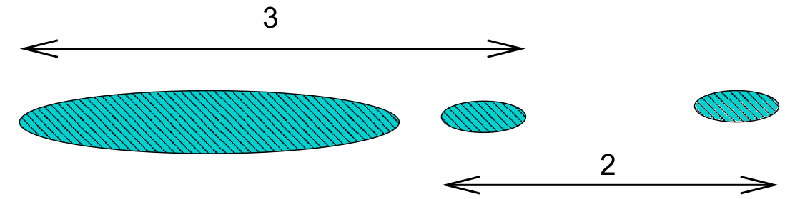

# Cluster Analysis

```{r, include=FALSE}
library(tidyverse)
knitr::opts_chunk$set(comment = "#>")
theme_set(theme_minimal())
options(pillar.sigfig = 5)
```

While classification looks to assign observations to pre-specified
categories using predictive modelling from *apriori* training data,
cluster analysis looks to assign observations to categories without any
apriori knowledge. In this chapter we will look at several approaches to
the detection and analysis of clusters. We start by developing a
methodology based upon measures of dissimilarity ('pseudo-distance', if
you like) between multivariate observations.

## Dissimilarity Matrices for Multivariate Data

Let $x_{ij}$ be the observed value of the $j$th variable for the $i$th
individual (where $i=1,\ldots,n$, $j=1,\ldots,p$). A *dissimilarity* (or
*proximity*) matrix $\Delta$ is an $n\times n$ matrix with element
$\delta_{st}$ being the dissimilarity between individuals $s$ and $t$.
The dissimilarities satisfy:

-   $\delta_{ss} = 0$ for all individuals $s$.

-   $\delta_{st} \ge 0$ for all $s, t$.

-   $\delta_{st} = \delta_{ts}$ for all $s, t$.

Some examples of dissimilarities include the following.

**Euclidean Distance**

Defined by $$\delta_{st} = \sqrt{\sum_{j=1}^p (x_{sj} - x_{tj})^2}.$$
(Often average Euclidean distance preferred, when above is divided by
$p$.) Suitable when all variables are numeric.

**Manhattan Distance**

Defined by $$\delta_{st} = \sum_{j=1}^p | x_{sj} - x_{tj} |.$$ (Often
average Manhattan distance preferred, when above is divided by $p$.)
Suitable when all variables are numeric.

**Simple Matching Coefficient**

The simple matching coefficient is a *similarity measure* for
categorical variables, given by
$$\gamma_{st} = p^{-1} \sum_{j=1}^p {\bf 1}[x_{sj} = x_{tj}]$$ where
${\bf 1}[A]$ is the indicator for the event: $${\bf 1}[A] = \left \{
\begin{array}{ll}
1 & A \mbox{ occurs}\\
0 & \mbox{otherwise}.
\end{array}
\right .$$ The corresponding dissimilarity is $$\begin{aligned}
\delta_{st} &= 1 - \gamma_{st}\\
            &= p^{-1} \sum_{j=1}^p {\bf 1}[x_{sj} \ne x_{tj}].\end{aligned}$$

Note: for binary data, average Manhattan distance and simple matching
coefficient give same dissimilarity.

**Jaccard Coefficient**

The Jaccard cofficient is a *similarity measure* for binary variables,
given by
$$\gamma_{st} = \frac{\sum_{j=1}^p {\bf 1}[x_{sj} = x_{tj} = 1]}
{\sum_{j=1}^p {\bf 1}[x_{sj} + x_{tj} > 0]}.$$ The corresponding
dissimilarity is $$\delta_{st} = 1 - \gamma_{st}.$$

Note that $\gamma_{st}$ is the proportion of variables on which the
individuals are matched once the variables on which both individuals
have a 0 response is removed. This is a very natural measure of
similarity when 1 represents presence of a rare characteristic, so that
the vast majority of individuals have 0 responses on most most
variables. In that situation, 0-0 matches provide almost no useful
information about the similarity between individuals. We therefore omit
these matches.

**Gower's dissimilarity**

Gower's dissimilarity was the metric used to identify nearest neighbours
in the `kNN()` function from `VIM`, which we discussed in \@ref(sec:imputation).
To compute Gower's dissimilarity we first divide any numeric variable by
it's range (to ensure all variables have range 1), and then use Manhattan
dissimilarity. For categorical variables we use simple matching. Gower's
distance is then the combination of these:
$$\gamma_{st} = \frac{1}{p_n}\sum_{j=1}^{p_n} \frac{|x_{sj} - x_{tj}|}{r_j} + \frac{1}{p_c} \sum_{j=1}^{p_c} {\bf 1}[x_{sj} = x_{tj}].$$ where $p_n$ is the number of numeric predictors,
$r_j$ the range of the $j$-th numeric variable, and $p_c$ the number of categorical predictors.

The R command for computing a dissimilarity matrix is

```{r, eval=FALSE}
dist(my.data, method=..., ...)
```

where

-   `my.data` is a data frame (or matrix, with variables as columns).

-   `method` can be

    -   `euclidean` (In R, total distance, not average).

    -   `manhattan` (In R, total distance, not average).

    -   `binary` -- the Jaccard *dissimilarity* coefficient.

## Hierarchical Clustering

Cluster analysis in statistics is a procedure for detecting groupings in
data with no pre-determined group definitions. This is in contrast to
*discriminant analysis*, which is the process of assigning observations
to pre-determined classes[^supervised].

Agglomerative hierarchical clustering uses the following algorithm.

1.  Initialise by letting each observation define its own cluster.

2.  Find the two most similar clusters and combine them into a new
    cluster.

3.  Stop if only one cluster remains. Otherwise go to 2.

To operate this algorithm we need to define disimilarities between
clusters. Options include:

Single linkage:

:   Let $\delta_{AB}$ denote dissimilarity between clusters $A$ and $B$
    using single linkage. Then
    $$\delta_{AB} = \min \{ \delta_{st}: \, s \in A, \, t \in B \}.$$

Complete linkage:

:   $$\delta_{AB} = \max \{ \delta_{st}: \, s \in A, \, t \in B \}.$$

Average dissimiliary:

:   $$\delta_{AB} = n_A^{-1} n_B^{-1} \sum_{s \in A} \sum_{t \in B}
    \delta_{st}$$ where $n_A$ and $n_B$ are number of members of
    clusters $A$ and $B$ respectively.

::: {.example}
**Dissimilarities Between Clusters**

Suppose that the dissimilarity matrix for 4 individuals
$$\Delta = \begin{array}{cc}
 & 1~~~~~2~~~~~3~~~~~4\\
\begin{array}{c}
1\\
2\\
3\\
4
\end{array}
& \hspace{-6pt} \left (
\begin{array}{rrrr}
  0 & 2.0 & 4.0 & 5.0 \\
2.0 & 0   & 4.5 & 3.0 \\
4.0 & 4.5 & 0   & 1.5 \\
5.0 & 3.0 & 1.5 & 0   
\end{array}
\right )
\end{array}$$
Consider clusters $A= \{ 1,2\}$ and $B = \{3,4\}$. Then
using single linkage, $$\delta_{AB} = \delta_{24} = 3.0.$$ Using
complete linkage, $$\delta_{AB} = \delta_{14} = 5.0.$$ Using average
dissimilarity,
$$\delta_{AB} = 2^{-1} \times 2^{-1} ( 4.0 + 5.0 + 4.5 + 3.0 ) = 4.125.$$
:::

The R command to perform hierarchical clustering is

```{r, eval=FALSE}
hclust(d.matrix, method=...)
```

where

-   `d.matrix` is a dissimilarity matrix.

-   `method` can be `single`, `complete` or `average` (amongst others).

The output from the analysis is the set of clusters at each iteration,
and the dissimilarity level at which the clusters formed. This can be
neatly displayed as a *dendrogram* -- see Example \@ref(exm:repubclust).

::: {.example #repubclust}
**Cluster Analysis for US Republican Voting Data**

The data set `repub` contained the percentage of the vote given to the
republican candidate in American Presidential elections from 1916 to
1976 for a selection of states. Looking for clusters containing states
with similiar voting patterns might be of potential interest to
political analysts. We could start by using a star plot as an informal
way to assess whether any clustering might be present. A star plot
presents a 2-dimensional summary of a multivariate dataset by plotting
variable values (normalized to lie between 0 and 1) as rays projecting
from the star's center. This technique allows for a quick comparison
between individuals in a dataset, allowing one to see which individuals
cluster together. Figure \@ref(fig:repubstars) is
produced using `stars(repub)`. It is quite
easy to see that there are several very similar states (in terms of
Republican voting). Notice the somewhat strange voting pattern in
Mississippi, where the Republican vote is usually poor but there are
some exceptional years (in comparison to other states).

```{r repubstars, echo=FALSE, message=FALSE, fig.cap="Stars plot for republican voting data.",fig.height=3}
repub <- read_csv("../data/repub.csv") %>%
  column_to_rownames("State") 
repub %>% stars(nrow=2, ncol=7, flip.labels = FALSE)
```

Applying the `hclust` command, R code for producing a dendrogram to
display hierarchical clustering is given below.

```{r, eval=FALSE}
repub <- read_csv("../data/repub.csv") %>%
  column_to_rownames("State")
repub.dist <- repub %>% dist(method = "euclidean")
repub.clust.single <- repub.dist %>% hclust(method = "single")
repub.clust.complete <- repub.dist %>% hclust(method="complete")
library(ggdendro)
ggdendrogram(repub.clust.single)
ggdendrogram(repub.clust.complete)
```

Note that we use `column_to_rownames()` here to move the `State` column
to the rownames. This is so that when we apply `dist()` to produce the
distance matrix, the rows and columns are labelled. These labels are
then kept through the `hclust()` functions. The `ggdendrogram()` function
from the `ggdendro` package gives us `ggplot2` consistent plotting.

The dendrograms produced are displayed in Figures \@ref(fig:repubsingle) and
\@ref(fig:repubcomplete). Note
that the dissimilarity between two groups can be read off from the
height at which they join. So, for example, with single linkage (in
Figure \@ref(fig:repubsingle) the group $\{ \textsf{Alabama}, \textsf{Georgia} \}$ and
the group $\{ \textsf{Arkansas}, \textsf{Florida}, 
\textsf{Texas} \}$ join at a dissimilarity of about 38. (In fact, the exact
figure is $37.79937$ which can be obtained by inspecting
`repub.clust.single$height`).

```{r repubsingle, echo=FALSE, message=FALSE, fig.cap="Dendrogram for Republican voting data, obtained using single linkage."}
library(ggdendro)
repub.dist <- dist(repub,"euclidean")
repub.clust.single <- hclust(repub.dist,method="single")
ggdendrogram(repub.clust.single)
```
```{r repubcomplete, echo=FALSE, fig.cap="Dendrogram for Republican voting data, obtained using complete linkage."}
repub.clust.complete <- hclust(repub.dist,method="complete")
ggdendrogram(repub.clust.complete)
```

Note that a dendrogram does not define a unique set of clusters. If the
user wants a particular set of clusters, then these can be obtained by
'cutting' the dendrogram at a particular height, and defining the
clusters according to the groups which formed below that height. For
instance, if we use a cut-off height of 75 with complete linkage then
three clusters emerge:

-   *Cluster 1*: New York, New Mexico, Washington, California, Oregon,
    Michigan, Kansas, Wyoming.

-   *Cluster 2*: Mississippi.

-   *Cluster 3*: Alabama, Georgia, Arkansas, Florida, Texas.

These groupings were obtained by inspection of the dendrogram. Such a
process would clearly have been laborious had all 50 states been present
in the data. Fortunately the R command `cutree` generates group
membership automatically.

```{r}
repub.groups.complete <- repub.clust.complete %>% cutree(h=75)
repub.groups.complete
```
:::

**Single and Complete Linkage Compared**

-   Single linkage is prone to 'chaining'. In the figure below the three
    groups on the right will merge together (in a kind of chain) before
    combining with the group on the left. Note that everything would
    change if a single datum were added midway between the two groups on
    the left -- these groups would then combine earlier than those on
    the right. This can be viewed as an unwanted lack of robustness with
    single linkage.
    
    ```{r, echo=FALSE}
    knitr::include_graphics('graphics/linkage_single.png')
    ```

    The central cluster in Figure \@ref(fig:repubsingle) in
    Example \@ref(exm:repubclust) shows an instance of chaining with real data.

-   The growth of large clusters at small heights is very unlikely under
    complete linkage. In the figure below the middle cluster will
    combine with the right hand cluster because the extreme left hand
    edge of the large left cluster is distant. Nonetheless, one's
    intuitive feel is that the middle cluster should first combine with
    left hand cluster.

    ```{r, echo=FALSE}
    
    ```

## K-means clustering

If we have some knowledge apriori of the number of clusters $K$, then
the problem of clustering changes to assigning each datum to a cluster
such that within-cluster variation is minimized (and between-cluster
variation maximised).

A naive way to address this problem is to compute the within-cluster
variation for all possible assignments the $n$ data points to $K$
clusters. We then pick the assignment with minimal variation. The
problem is that the number of possible assignments is given by:
$$S(n,K) = \frac{1}{K!}\sum_{k=1}^K (-1)^{K-k}\dbinom{K}{k}k^n.$$ The
leading term here is $\frac{K^n}{K!}$ which gets large very quickly as
$n$ increases! We thus settle for an approximate solution via the
iterative $K$-means algorithm.

For a set of $n$ numerical datapoints $x_i$, the average total variation
in the data may be measured using
$$T=\frac{1}{2N}\sum_{i=1}^n\sum_{j=1}^n d(x_i,x_j)$$ where $d$ is the
dissimilarity metric. If we denote $C(i)$ as the cluster that point
$x_i$ is assigned to, we may re-write this as $$\begin{aligned}
T &= \frac{1}{2N}\sum_{k=1}^K\sum_{C(i)=k}\left(\sum_{C(j)=k}d(x_i,x_j) + \sum_{C(j)\neq k}d(x_i,x_j)\right)\\
  &= W(C) + B(C).\end{aligned}$$ where $W(C)$ is the within-cluster
variation
$$W(C) = \frac{1}{2N}\sum_{k=1}^K\sum_{C(i)=k}\sum_{C(j)=k}d(x_i,x_j),$$
and $B(C)$ is the between-cluster variation
$$B(C) = \frac{1}{2N}\sum_{k=1}^K\sum_{C(i)=k}\sum_{C(j)\neq k}d(x_i,x_j).$$
Noting that $T$ is a constant, minimizing $W(C)$ is equivalent to
maximising $B(C)$.

If $d(x_i,x_j)$ is the Euclidean distance, then these simplify to
$$\begin{aligned}
W(C) &= \sum_{k=1}^K \sum_{C(i)=k} (x_i - \mu_k)^2,\\
B(C) &= \sum_{k=1}^K N_k (\mu_k - \mu)^2,\\\end{aligned}$$ where $N_k$
is the number of data points in cluster $k$, $\mu_k$ is the mean of the
data points in cluster $k$, and $\mu$ is the mean of all datapoints
(grand mean).

This gives us the basis of the $K$-means algorithm:

0.  Start by placing the cluster means $\mu_k$ arbitrarily.

1.  Compute the cluster assignment by assigning each datapoint $x_i$ to
    the closest cluster mean:
    $$C(i) = \mathop{\mathrm{arg\,min}}_{1 \leq k \leq K} (x_i - \mu_k)^2.$$

2.  Recompute the cluster means $\mu_k$.

3.  Repeat from 1 until $\mu_k$ reach convergence.

Note the similarity with linear discriminant analysis: Rather than have
a training data set define the cluster means and then assigning
observations to the closest cluster, we use an iterative procedure where
data from the previous iteration may be considered the training data.

There are a number of pros and cons to this method.

-   The algorithm is simple to implement, requiring only means and
    distances to be calculated.

-   The algorithm will always converge, but may only converge to a local
    minima rather than the global minimum[^avoidminima].

-   It is restricted to numerical data.

-   As means are used (Euclidean distance), outliers may be problematic.

-   Requires apriori knowledge of the number of clusters $K$.

::: {.example #kmeans}
**$K$-means example on synthetic data**

Given randomly generated data from 3 distributions in two-dimensions in
Figure \@ref(fig:kmeans1).

```{r kmeans1, echo=FALSE, fig.cap="Data generated from 3 distributions for Example \\@ref(exm:kmeans)."}
set.seed(2)
x <- cbind(rnorm(20, 0.3, 0.1), rnorm(20, 0.3, 0.1))
x <- rbind(x, cbind(rnorm(20, 0.3,0.15), rnorm(20, 0.7,0.15)))
x <- rbind(x, cbind(rnorm(20, 0.8,0.08), rnorm(20, 0.2,0.05)))
clust <- data.frame(x=x[,1],y=x[,2],col=rep(c(1,2,3),each=20))
par(mar = c(1,1,1,1))
plot(clust$x, clust$y, col=clust$col, main="", xlab="", ylab="", pch=19, asp=1,
     axes=FALSE)
box()
```

We'd expect that $K=3$ is reasonable, so let's explore how the $K$-means
algorithm operates: Figure \@ref(fig:kmeans2) shows the initial (random)
cluster means, and
several further iterations of the algorithm. We seed the algorithm by
sampling 3 points randomly from the data. Notice how with even
relatively poor choices for the initial cluster means, the algorithm
still correctly identifies the clusters in this case, and converges
quite quickly: There's very little difference in the cluster means after
the 8th iteration. The similarity with linear discriminant analysis is
seen here as well, in that you can imagine lines bisecting the midpoints
of the pair-wise cluster means dividing the region into partitions that
contain each cluster.

```{r kmeans2, echo=FALSE, fig.cap="The $K$-means algorithm in practice after several iterations for Example \\@ref(exm:kmeans)."}
assign_to_cluster <- function(xy, centers) {
  # assign to centers
  c <- rep(1,nrow(xy));
  for (i in 1:length(c)) {
    d <- sum((xy[i,] - centers[1,])^2)
    for (k in 2:nrow(centers)) {
      d2 <- sum((xy[i,] - centers[k,])^2)
      if (d2 < d) {
        c[i] <- k
        d <- d2
      }
    }
  }
  return(c)
}

compute_centroids <- function(xy, c) {
  # re-evaluate centers
  centers <- matrix(0,max(c),ncol(xy))
  for (k in 1:nrow(centers)) {
    wch <- which(c==k)
    centers[k,] <- colSums(xy[wch,]) / length(wch)
  }
  return(centers)
}

run_iterations <- function(xy, centers, iters) {
  max_iters = max(iters$num)
  for (i in 1:max_iters) {
    c <- assign_to_cluster(xy, centers)
    if (length(which(iters$num == i)) > 0) {
      plot(xy[,1], xy[,2], col=c, main=iters$name[which(iters$num==i)], xlab="", ylab="", pch=19, asp=1,
     axes=FALSE)
      points(centers, col=1:3, pch=8)
      box()
    }
    centers <- compute_centroids(xy, c);
  }
}

par(mfrow=c(2,3))
par(omi=c(0,0,0,0), mar=c(1,1,1,1))
xy <- clust[,1:2]
centers <- xy[c(4,59,55),]
iters <- data.frame(num=c(1,2,3,5,9,17),name=c("Initial means", "Iteration 1", "Iteration 2", "Iteration 4", "Iteration 8", "Iteration 16"));
run_iterations(xy, centers, iters)
```

In order to find an appropriate value for $K$, one method is to apply
the $K$-means algorithm for a number of different values for $K$, and
compare the within cluster variance produced under each value. It's
clear that the within-cluster variance will decrease monotonically, so
rather than looking for the smallest value we instead look to see which
value of $K$ results in the largest decrease compared to $K-1$ -
typically we're looking for the 'kink' in the graph of the within
cluster variance versus $K$. Figure \@ref(fig:kmeans3) shows
this for the above example. The majority of the reduction in cluster
variance occurs by $K=3$, and while things continue to improve, the
relative improvement is minor.

```{r kmeans3, echo=FALSE, fig.cap="The within cluster variance for one to six clusters for Example \\@ref(exm:kmeans)"}
ss_clusters <- function(data, c=rep(1,nrow(data))) {
  d <- 0;
  for (k in 1:max(c)) {
    dat <- data[c==k,]
    center=colMeans(dat)
    for (i in 1:nrow(dat)) {
      d <- d + sum((dat[i,] - center)^2)
    }
  }
  return(d)
}
plot_ss <- function(dat) {
  ss <- rep(0,6)
  ss[1] <- ss_clusters(dat)
  for (k in 2:6)
    ss[k] <- ss_clusters(dat, kmeans(dat, k, nstart=10)$cluster)
  plot(1:6,ss, type="l", xlab="Number of clusters", ylab="Within cluster variation")
}
plot_ss(xy)
```
:::

The $K$-means algorithm is implemented using the `kmeans` function in R
which has syntax

```{r, eval=FALSE}
kmeans(x, centers, nstart = 1)
```

where `x` is the data, `centers` the number of clusters, and `nstart`
may be optionally specifed to run the algorithm several times from
different starting points, helping to minimise the chance of us being
left with a local minima rather than the global minimum. The output
class contains components

-   `clusters`: the cluster assignment for each observation.

-   `centers`: the center of each cluster.

-   `withinss`: the within cluster variation (sum of squares).

-   `size`: the size of each cluster.

::: {.example #iris}
**$K$-means to Fisher's Iris data**

Fisher's Iris data is a dataset collected by Edgar Anderson in order to
quantify the morphological variance of three related species of Iris.
The data consist of 50 samples of each species, with 4 measurements on
each flower (sepal and petal length and widths). We'll use the first 3
of these in this example: Sepal length, Sepal width, and Petal length.
We use the `kmeans` function to analyse the data, under the assumption
that we don't know the actual species, and see whether the $K$-means
algorithm is useful at distinguishing these species. We'll use the `rgl`
library in order to plot scatterplots in 3d.

```{r iris1, echo=FALSE, fig.cap="The actual species (left) and clusters found using $K$-means with 3 clusters (right) for Example \\@ref(exm:iris)."}
library(rgl)
data(iris)
set.seed(23)
k <- kmeans(iris[,1:3], 3, nstart=10);
mfrow3d(nr = 1, nc = 2, sharedMouse = TRUE)
plot3d(iris[,1:3], col=as.numeric(iris$Species), pch=19, box=FALSE)
rgl.viewpoint(theta = 35, phi = 15)
plot3d(iris[,1:3], col=as.numeric(k$cluster), pch=19, box=FALSE)
rgl.viewpoint(theta = 35, phi = 15)
rglwidget()
```

Figure \@ref(fig:iris1)
compares the actual species (on the left) with the clusters found by the
$K$-means algorithm on the right. From this angle (you can rotate the
plot with the mouse) it appears the $K$-means algorithm is
recovering the individual species relatively well. The plots were
produced using the following R code.

```{r, eval=FALSE}
library(rgl)
plot3d(iris[,1:3], col=as.numeric(iris$Species), pch=19, box=FALSE)
k <- kmeans(iris[,1:3], 3, nstart=10)
plot3d(iris[,1:3], col=k$cluster, pch=19, box=FALSE)
```

Notice that we're specifying `nstart=10` when using `kmeans`. This
requests that the $K$-means algorithm is run using 10 separate starting
cluster positions, helping to minimise the chance of us being left with
a local minima rather than the global minimum.

```{r iris2, echo=FALSE, fig.cap="The actual species (left) and clusters found using $K$-means with 3 clusters (right) for Example \\@ref(exm:iris)."}
mfrow3d(nr = 1, nc = 2, sharedMouse = TRUE)
plot3d(iris[,1:3], col=as.numeric(iris$Species), pch=19, box=FALSE)
rgl.viewpoint(theta = -30, phi = 60)
plot3d(iris[,1:3], col=as.numeric(k$cluster), pch=19, box=FALSE)
rgl.viewpoint(theta = -30, phi = 60)
rglwidget()
```

Figure \@ref(fig:iris2) shows
a different angle of the same plot, where it is clear that the $K$-means
algorithm has a harder time differentiating between *Iris versicolor*
and *Iris virginia*. Figure \@ref(fig:iris3) highlights this, in that while the $K$-means
algorithm distinguishes two clusters well, the three cluster does not
improve things all that much: Without knowing that we had three species,
we may have concluded there were two.

```{r iris3, echo=FALSE, fig.cap="Cluster size versus within cluster variation for Example \\@ref(exm:iris)."}
plot_ss(iris[,1:3])
```

:::

::: {.example}

**$K$-means for image compression**

One use of $K$-means (or any clustering method) is in image compression.
Given an image, a simple way to compress the image is to replace each
pixel (which is normally represented using 4 bytes) with an index into a
smaller colour palette. If we can replace all the pixels in the image
with just 16 colours for example, each pixel would then take up just 0.5
bytes, a compression ratio of 1:8. Replacing arbitrary colours by a
small set is exactly the problem that clustering is attempting to solve.
It works best on images that have few colour gradients, rather than on
images with lots of subtle colour differences. Figure \@ref(fig:cartoon)
shows the same image clustered using a range of colours.

```{r cartoon, echo=FALSE, fig.cap="The same image clustered using top, from left: 2, 4, 8 colours and bottom from left: 16, 32, 256 colours.", fig.show='hold', out.width="33%"}
knitr::include_graphics(file.path("graphics", sprintf("test01_%02i.png", c(2,4,8,16,32,256))))
```

:::

## K-medoids clustering

So far we have used only the Euclidean distance as our dissimilarity
measure. The Euclidean distance is not appropriate, however, if we have
categorical data, or the data are on very different scales. Instead, the
$K$-mediods algorithm may be used which uses only the distances between
data points, allowing any dissimilarity matrix to be used. The algorithm
is as follows:

0.  Pick initial data points to be cluster centers $m_k$.

1.  Compute the cluster assignment by assigning each datapoint $x_i$ to
    the closest cluster center.
    $$C(i) = \mathop{\mathrm{arg\,min}}_{1 \leq k \leq K} d(x_i, m_k).$$

2.  Find the observation in each cluster that minimises the total
    distance to other points in that cluster.
    $$i_k = \mathop{\mathrm{arg\,min}}_{C(i)=k} \sum_{C(j)=k} d(x_i, x_j).$$

3.  Assign $m_k = x_{i_k}$.

4.  Repeat from 1 until the $m_k$ reach convergence.

This is significantly more costly than $K$-means as we have lost the
simplification of using the means of each cluster as the center. The
`pam` function (Partitioning Around Medoids) in the `cluster` package
may be used to compute the $K$-medoids of a dataset. Like `hclust`, it
can take a dissimilarity object directly, thus overcoming the
restriction of utilising only the Euclidean distance function. The
syntax is

```{r, eval=FALSE}
pam(x, k, diss = inherits(x, "dist"), metric = "euclidean")
```

where `x` is either a data frame or a dissimilarity matrix, `k` is the
number of clusters `diss` is `TRUE` if `x` is a dissimilarity matrix or
`FALSE` otherwise, and metric specifies the dissimilarity measure to use
in the case `x` is a data frame.

::: {.example}
**$K$-medoids to Republican voting data**

We show how to use the `pam` function on the US republican voting data
from example \@ref(exm:repubclust).

```{r, message=FALSE}
library(cluster)
pam(repub, 3, FALSE, metric="manhattan")
```

Here we've used the Manhattan distance as opposed to the Euclidean
distance, yet we've retreived the same grouping as we did in example
\@ref(exm:repubclust), with Mississippi being in a cluster on it's own, and the other
states grouping into two clusters. We could also do this using some
other distance measures, by passing the dissimilarity object into `pam`
instead of the data frame.

```{r}
repub.dist <- dist(repub, method="manhattan")
pam(repub.dist, k=3)
```
:::

## Silhouette plots

We've already mentioned one heuristic that can be used to determine the
most appropriate number of clusters for the data. Another technique is
to use a silhouette plot which is produced using the `cluster` package.

Given a clustering, the silhouette $s(i)$ of an observation $x_i$ is a
measure of how well $x_i$ fits into the cluster to which it has been
assigned, compared with the other clusters. It is computed using
$$s(i) = \frac{b(i) - a(i)}{\max\{a(i),b(i)\} },$$ where $a(i)$ is the
average dissimilarity between $x_i$ and the rest of the points in the
cluster to which $x_i$ belongs, and $b(i)$ is the smallest average
dissimilarity between $x_i$ and the points in the other clusters[^silzero].
Figure \@ref(fig:silhouette) shows this diagramatically.

```{r silhouette, echo=FALSE, fig.cap="$x$ lies in cluster $A$, so $a(i)$ will be the average of the dissimilarities to other points in $A$. $b(i)$ will be the average dissimilarity to points in cluster $B$ as this is smaller than the average dissimilarity to cluster $C$."}
x1 <- c(0.3,0.37,0.45)
y1 <- c(0.2,0.3,0.15)
x2 <- c(0.7,0.8,0.85,0.75)
y2 <- c(0.62,0.7,0.61,0.55)
x3 <- c(0.2,0.25,0.32)
y3 <- c(0.6,0.7,0.65)
x <- 0.35
y <- 0.55
par(mar=c(0,0,0,0))
plot(c(x1,x2,x3,x),c(y1,y2,y3,y), xlim=c(0,1), ylim=c(0,1), xaxt="n", yaxt="n", xlab="", ylab="", pch=19,
     asp=1)
for (i in 1:length(x1)) lines(c(x1[i],x),c(y1[i],y))
for (i in 1:length(x2)) lines(c(x2[i],x),c(y2[i],y))
for (i in 1:length(x3)) lines(c(x3[i],x),c(y3[i],y))
text(x-0.04,y-0.015,"x")
theta <- seq(0,2*pi,by=2*pi/100)
lines(0.38+0.12*cos(theta),0.22+0.12*sin(theta), lty="dotted")
text(0.38,0.22-0.17,"B")
lines(0.77+0.12*cos(theta),0.63+0.12*sin(theta), lty="dotted")
text(0.77,0.63+0.17,"C")
lines(0.28+0.12*cos(theta),0.62+0.12*sin(theta), lty="dotted")
text(0.28,0.62+0.17,"A")
```

Notice that $s(i)$ can be at most $1$ when $a(i)$ is small compared to
$b(i)$, suggesting that $x_i$ has been assigned to the correct cluster,
as all other clusters are much further away. $s(i)$ can be as low as -1,
however, when $b(i)$ is small compared to $a(i)$, which occurs if $x_i$
would be better suited in a different cluster. An $s(i)$ value of $0$
indicates that $x_i$ is equally close to two or more clusters.

A *silhouette plot* is a plot of the silhouettes of each observation,
grouped by cluster, and sorted by decreasing silhouette. These plots
give a visual indication of how the well clustered the data are: High
silhouette values indicate well grouped clusters, with low silhouette
values indicating clusters that are close to each other (which may
suggest that they should be grouped together).

The average silhouette across all data may be used as a measure of how
well clustered the data are. As the number of clusters increases, we
would expect clustering to improve until a point is reached where a
cluster is split into two or more clusters that remain close to one
another (and thus not well grouped). Finding the number of clusters for
which the average silhouette is maximised is often a reasonable
heuristic for determining the appropriate number of clusters in a
dataset.

A silhouette plot may be generated by using `plot` on a `silhouette`
class, which can be generated from the output to `pam`, or by a
dissimilarity matrix and a cluster vector. For the Republican voting
data we have the following.

```{r silhouetterepub, fig.show='hold', out.width='50%', fig.cap='Silhouette plots of the republican voting data'}
library(cluster)
repub.dist <- dist(repub, method="manhattan")
repub.pam.1 <- pam(repub.dist, k=3)
repub.pam.2 <- pam(repub.dist, k=4)
plot(silhouette(repub.pam.1), border=NA, do.clus.stat=FALSE, do.n.k=FALSE,
     main="3 clusters")
plot(silhouette(repub.pam.2), border=NA, do.clus.stat=FALSE, do.n.k=FALSE,
     main="4 clusters")
```

Figure \@ref(fig:silhouetterepub) shows the resulting plots. Points to note:

-   We have used `border=NA` to make sure the barplot that is produced
    has no border. This is important as the default plotting mode on
    Windows has no anti-aliasing enabled, which means transparent
    borders don't correctly let the colour from the bars through so you
    end up with no bars. Setting the border to `NA` fixes this as it
    turns the border off.

-   We have used `do.clus.stat=FALSE` and `do.n.k=FALSE` to turn off some of the
    statistics that might otherwise crowd the plot. Experiment with
    these yourself.

-   The Mississippi silhouette is defined to be 1, as it is the only
    point in its cluster (and thus the average dissimilarity to other
    points in the cluster is not well-defined). To highlight this
    special-case, the silhouette bar has not been plotted.

-   There is a higher average silhouette for 3 clusters rather than 4,
    and some evidence in the 4 cluster silhouette plot that at least one
    of the clusters is not well grouped, with Arkansas having a low
    silhouette. Further information about this may be found by printing
    the silhouette output from the `pam` object:

    ```{r}
    repub.pam.2 %>% pluck('silinfo', 'widths')
    ```

    We can see that Arkansas lies between cluster 1 and cluster 3,
    perhaps suggesting that these two clusters may be artificially
    split.

If you wish to generate a silhouette plot for output from `kmeans` or
`hclust` you can use the second form of the `silhouette` command

```{r, eval=FALSE}
silhouette(x, dist)
```

where `x` is a vector with the cluster numbers of each observation, such
as `clusters` returned from `kmeans` or the output of `cutree`, and
`dist` is a dissimilarity matrix, normally computed using `dist`. Note
that you need not use the same dissimilarity measure as was used to
generate the clustering. (e.g. the squared Euclidean measure used in
`kmeans`). For the `iris` data this may be done as follows.

```{r silhouetteiris, fig.show='hold', out.width="50%", fig.cap="Silhouette plots of the iris data set"}
iris.kmeans.1 <- kmeans(iris[,1:4], 3)
iris.kmeans.2 <- kmeans(iris[,1:4], 4)
iris.dist <- dist(iris[,1:4])
plot(silhouette(iris.kmeans.1$cluster, dist=iris.dist), border=NA, do.clus.stat=FALSE, do.n.k=FALSE)
plot(silhouette(iris.kmeans.2$cluster, dist=iris.dist), border=NA, do.clus.stat=FALSE, do.n.k=FALSE)
```

Plots are given in Figure \@ref(fig:silhouetteiris). Points to note:

-   It is clear that the first cluster in the 3-cluster case has been
    split in two in the 4-cluster case, each of which has lower average
    silhouette, suggesting this split is artificial.

-   Notice in the 4-cluster plot there is a point with negative
    silhouette towards the bottom of the plot. This suggests that this
    point may be better suited in one of the other clusters. Whilst the
    $k$-means algorithm has assigned this point to the closest cluster
    based on the cluster centroid, that doesn't necessarily mean that it
    is closest to all the points in that cluster. The different ways of
    measuring how close a point is to each cluster (e.g. cluster
    centroid versus average dissimilarity to other points in the
    cluster) may give different results, in the same way that single and
    complete linkage give different results in heirarchical clustering.

[^supervised]: In fields such as computer science and image analysis, cluster
    analysis is referred to as *unsupervised learning* and discriminant
    analysis is referred to as *supervised learning*.

[^avoidminima]: One potential way to avoid local minima is to start with a number
    of different initial cluster mean positions and pick the result that
    gives smallest within-cluster variation.

[^silzero]: If a cluster contains only one point, the average dissimilarity to
    other points in the cluster is not well defined. We use the natural
    definition that $a(i)\equiv 0$ which gives $s(i)=1$ in this case.
